# 更适合北大宝宝体质的 Bomb Lab 踩坑记

写在前面：我写本篇博文的目的是为了帮助同学们更好的完成 lab，而不是完全的直接帮你把 lab 写完，且不说每个人的炸弹都不一样，如果你完全的照搬我的方法，而不去思考每条汇编指令的意义，去学习它们，那么你一定会在考试中吃大亏。

在做这个 lab 之前，推荐安装 VS Code [x86 and x86_64 Assembly 扩展](https://marketplace.visualstudio.com/items?itemName=13xforever.language-x86-64-assembly)，以获得汇编的语法高亮。

在 Bomb lab 里，我们需要拆除一系列的炸弹，每个炸弹都有一个密码，我们需要通过输入正确的密码来拆除炸弹。如果输入错误，炸弹就会爆炸，而每次爆炸，**我们都会失去 0.5 分（上限 20 分）**。

所以，对于程序一无所知的我们，显然不能直接莽撞地直接去猜密码，而是需要借助拆弹工具 `gdb` 来帮忙防止爆炸，同时通过阅读源码和反编译出的汇编代码来分析程序的逻辑，从而找到正确的密码。

## 阅读源码

想要拆弹，肯定首先要阅读源码。这个 lab 的源码在 `bomb.c` 中，可以看到这个程序的主要逻辑大概是：

```c
int main(int argc, char *argv[])
{
    // ...
    initialize_bomb();
    // ...
    input = read_line();
    phase_1(input);
    phase_defused(fp);
    printf("Phase 1 defused. How about the next one?\n");
    // ...
    return 0;
}
```

可以看到，这个程序的每个阶段都是通过 `phase_x` 函数来实现的，而 `phase_x` 函数的参数是 `input`，也就是我们输入的字符串。所以，我们的目标就是找到每个阶段的 `input`，然后通过分析 `phase_x` 函数来找到正确的 `input`。

首先让我们来反编译一下整个 `bomb` 这个二进制程序：

```bash
objdump -d bomb > bomb.asm
```

阅读源码，我们发现每个 phase 都大概具有如下结构：

```asm
0000000000001778 <phase_1>:
    1778:	f3 0f 1e fa          	endbr64
    177c:	48 83 ec 08          	sub    $0x8,%rsp
    1780:	48 8d 35 79 2a 00 00 	lea    0x2a79(%rip),%rsi        # 4200 <_IO_stdin_used+0x200>
    1787:	e8 d3 05 00 00       	call   1d5f <strings_not_equal>
    178c:	85 c0                	test   %eax,%eax
    178e:	75 05                	jne    1795 <phase_1+0x1d>
    1790:	48 83 c4 08          	add    $0x8,%rsp
    1794:	c3                   	ret
    1795:	e8 28 09 00 00       	call   20c2 <explode_bomb>
    179a:	eb f4                	jmp    1790 <phase_1+0x18>
```

可以看到，每个 phase 内都有一个类似于 jne 的条件跳转指令，跳转到 `explode_bomb` 函数，也就是说，如果我们的输入不正确，就会引爆炸弹。那么，一个很重要的事情，就是在其真正进入引爆流程之前，我们一定要打断这个函数的执行。

这就需要使用到 `gdb` 工具了。

有关 `gdb` 的具体指令简介，在书上的 3.10.2 小节，我推荐大家在做 bomb lab 之前一定要提前看一下。

在此，我只介绍一些我在做这个 lab 时用到的一些指令。

| 指令        | 全称  | 描述                                             |
| ----------- | ----- | ------------------------------------------------ |
| r           | run   | 开始执行程序，直到下一个断点或程序结束           |
| q           | quit  | 退出 GDB 调试器                                  |
| ni          | nexti | 执行下一条指令，但不进入函数内部                 |
| si          | stepi | 执行当前指令，如果是函数调用则进入函数           |
| b           | break | 在指定位置设置断点                               |
| c           | cont  | 从当前位置继续执行程序，直到下一个断点或程序结束 |
| p           | print | 打印变量的值                                     |
| x           |       | 打印内存中的值                                   |
| j           | jump  | 跳转到程序指定位置                               |
| disas       |       | 反汇编当前函数或指定的代码区域                   |
| layout asm  |       | 显示汇编代码视图                                 |
| layout regs |       | 显示当前的寄存器状态和它们的值                   |

我一般启动 `gdb bomb` 后，都会首先使用 `layout asm`、`layout regs` 开启视图，方便分析。

关闭 `layout` 的方式为，按下 `Ctrl + x`，然后再按下 `a`。

关于 `p` 和 `x`，最重要的就是记得 `p` 命令用于打印表达式的值，而 `x` 命令则主要用于检查内存的内容。几个常用示例如下：

```bash
p $rax  # 打印寄存器 rax 的值
p $rsp  # 打印栈指针的值
p/x $rsp  # 打印栈指针的值，以十六进制显示
p/d $rsp  # 打印栈指针的值，以十进制显示

x/2x $rsp  # 以十六进制格式查看栈指针 %rsp 指向的内存位置 M[%rsp] 开始的两个单位。
x/2d $rsp # 以十进制格式查看栈指针 %rsp 指向的内存位置 M[%rsp] 开始的两个单位。
x/2c $rsp # 以字符格式查看栈指针 %rsp 指向的内存位置 M[%rsp] 开始的两个单位。
x/s $rsp # 把栈指针指向的内存位置 M[%rsp] 当作 C 风格字符串来查看。

x/b $rsp # 检查栈指针指向的内存位置 M[%rsp] 开始的 1 字节。
x/h $rsp # 检查栈指针指向的内存位置 M[%rsp] 开始的 2 字节（半字）。
x/w $rsp # 检查栈指针指向的内存位置 M[%rsp] 开始的 4 字节（字）。
x/g $rsp # 检查栈指针指向的内存位置 M[%rsp] 开始的 8 字节（双字）。

info registers  # 打印所有寄存器的值
info breakpoints  # 打印所有断点的信息

delete breakpoints 1  # 删除第一个断点，可以简写为 d 1
```

这些命令在 `/` 后面的后缀（如 `2x`、`2d`、`s`、`g`、`20c`）指定了查看内存的方式和数量。具体来说：

-   第一个数字（如 `2`、`20`）指定要查看的单位数量。
-   第二个字母（如 `x`、`d`、`s`、`g`、`c`）指定单位类型和显示格式，其中：

    -   `c` / `d` / `x` 分别代表以字符 / 十进制 / 十六进制格式显示内存内容。
    -   `s` 代表以字符串格式显示内存内容。
    -   `b` / `h` / `w` / `g` 分别代表以 1 / 2 / 4 / 8 字节为单位（`unit`）显示内存内容。

        当使用 `x/b`、`x/h`、`x/w`、`x/g` 时，`unit` 会保留对应改变，直到你再次使用这些命令。

## 安全化炸弹

一个随时会引爆的炸弹总是让人胆战心惊，但如果是一个安全的炸弹，那我们就可以放心地去拆弹了。

把炸弹安全化的方式有两种，它们都需要分析 `objdump` 反汇编出的代码，然后：

-   找到相关代码，再利用 `hexedit` 工具修改二进制码，替换条件跳转指令或者使用 `nop` 无义指令替换危险指令。
-   找到相关代码，再利用 `gdb` 工具为危险函数或者危险指令设置断点，并对于断点处进行编程，跳过危险指令或者修改寄存器的值来控制条件跳转，使得炸弹不会爆炸。

在此，我仅介绍第二种方法。

`gdb` 有一个很实用的功能，就是我们可以使用 `.gdbinit` 文件来设置 `gdb` 进入时的一些默认配置，这样我们就不用每次都手动输入一大堆的指令。

为了实现此功能，我们首先进行如下配置：

```bash
# 创建当前目录下的 .gdbinit 文件
touch .gdbinit
# 创建 .config/gdb 文件夹
mkdir -p ~/.config/gdb
# 允许 gdb 预加载根目录下所有的文件
echo "set auto-load safe-path /" > ~/.config/gdb/gdbinit
```

然后，我们打开工作目录的 `.gdbinit` 文件，输入如下内容：

```bash
# ./gdbinit
# 设置默认文件输入，这样我们不必每次手动输入答案
set args psol.txt

# 可以为 explode_bomb 函数设置断点，这样我们就可以在爆炸之前打断程序的执行
# 但是由于其会打印输出信息，所以后面有更具有针对性的设置，跳过信息发送函数
# 所以这里就不再设置断点了
# b explode_bomb

# 为各个 phase 函数设置断点，用以观察其执行过程
# 如果你做完了某个 phase，可以将其注释掉，这样就不会再进入该 phase 了
b phase_1
b phase_2
b phase_3
b phase_4
b phase_5
b phase_6

# 为校验函数设置断点
b phase_defused
# 为此断点编程
command
# 直接跳到返回语句处，跳过校验流程
jump *(phase_defused + 0x2A)
end


# 以下代码务必保留!!!

# 为 explode_bomb 中触发 send_msg 函数的地方设置断点
b *(explode_bomb + 0x44)
# 为此断点编程
command
# 直接跳到 exit 退出函数处，跳过发送信息流程
j *(explode_bomb + 0x81)
end

# 炸弹已经安全化，可以放心地拆弹了，开始运行程序
r
```

因为每年的炸弹可能不一样，所以授人以鱼不如授人以渔，我在此详细的介绍一下如何安全化炸弹的过程，请大家自行阅读自己的代码，调整其中的参数，以适配自己的炸弹。

炸弹的执行有如下流程：

首先，在开始时校验是否被本地化，如果检测到被本地化，则直接退出

```c
int *fp = initialize_bomb();

if (*fp != SECRETTOKEN){
    printf("Don't try to make the bomb run on your local machine!(*/w＼*)");
    return 0;
}
```

由于我们没有通过修改二进制码的方式来本地化炸弹，所以我们不需要处理这里，但还是给出一个跳过这个 if 语句的 gdb 调试方法供参考：

```bash
b *(main+0x2e)
command
j *(main+0xb0)
end
```

然后，在每个 phase 里检验是否输入了正确的密码，如果输入错误则调用 `explode_bomb` 函数，打印 `BOOM!!!`，并在其中调用 `send_msg` 函数，向服务器发送通知

```asm
000000000000211b <explode_bomb>:
    211b:	f3 0f 1e fa          	endbr64
    211f:	50                   	push   %rax
    2120:	58                   	pop    %rax
    2121:	48 83 ec 18          	sub    $0x18,%rsp
    2125:	64 48 8b 04 25 28 00 	mov    %fs:0x28,%rax
    212c:	00 00
    212e:	48 89 44 24 08       	mov    %rax,0x8(%rsp)
    2133:	31 c0                	xor    %eax,%eax
    2135:	48 8d 3d fa 25 00 00 	lea    0x25fa(%rip),%rdi        # 4736 <array.3497+0x336>
    213c:	e8 2f f1 ff ff       	call   1270 <puts@plt>
    2141:	48 8d 3d f7 25 00 00 	lea    0x25f7(%rip),%rdi        # 473f <array.3497+0x33f>
    2148:	e8 23 f1 ff ff       	call   1270 <puts@plt>
    214d:	c7 44 24 04 00 00 00 	movl   $0x0,0x4(%rsp)
    2154:	00
    2155:	48 8d 74 24 04       	lea    0x4(%rsp),%rsi
    215a:	bf 00 00 00 00       	mov    $0x0,%edi
    215f:	e8 4d fe ff ff       	call   1fb1 <send_msg>
    2164:	83 7c 24 04 01       	cmpl   $0x1,0x4(%rsp)
    2169:	74 20                	je     218b <explode_bomb+0x70>
    216b:	48 8d 35 6e 23 00 00 	lea    0x236e(%rip),%rsi        # 44e0 <array.3497+0xe0>
    2172:	bf 01 00 00 00       	mov    $0x1,%edi
    2177:	b8 00 00 00 00       	mov    $0x0,%eax
    217c:	e8 df f1 ff ff       	call   1360 <__printf_chk@plt>
    2181:	bf 08 00 00 00       	mov    $0x8,%edi
    2186:	e8 05 f2 ff ff       	call   1390 <exit@plt>
    218b:	48 8d 3d 96 23 00 00 	lea    0x2396(%rip),%rdi        # 4528 <array.3497+0x128>
    2192:	e8 d9 f0 ff ff       	call   1270 <puts@plt>
    2197:	bf 08 00 00 00       	mov    $0x8,%edi
    219c:	e8 ef f1 ff ff       	call   1390 <exit@plt>
```

我们的代码，通过在 `call   1fb1 <send_msg>` 这一句处设置断点，然后直接跳到 `call   1390 <exit@plt>` 这一句处，完整的跳过了 `send_msg` 函数的执行，从而使得服务器无从知道我们的炸弹爆炸了。

这对应我们的 `.gdbinit` 文件中的如下代码：

```bash
# 为 explode_bomb 中触发 send_msg 函数的地方设置断点
b *(explode_bomb + 0x44)
# 为此断点编程
command
# 直接跳到 exit 退出函数处，跳过发送信息流程
j *(explode_bomb + 0x81)
end
```

其中两个断点的计算方式为：

由于 `explode_bomb` 函数的地址为 `0x211b`，而 `call send_msg` 指令的地址为 `0x215f`，所以 `call send_msg` 指令的偏移量为 `0x215f - 0x211b = 0x44`。

同理，`call exit` 函数的地址为 `0x219c`，所以 `call exit` 函数的偏移量为 `0x219c - 0x211b = 0x81`。

或许你会问为什么不直接使用 `b 0x215f` 和 `b 0x219c` 来设置断点？这是因为我们的炸弹每次运行的地址都不一样，所以我们需要使用相对地址来设置断点。而这点你会在后续学习第七章链接的时候有所了解，或者是在做下一个 Attack Lab 的时候就会知道了，这就是地址随机化（Address Space Layout Randomization，ASLR）。

最后，在每个 phase 里，如果输入正确，则调用 `phase_defused` 函数，同服务器进行通信，~~（同学学号报一下，给你加创新学分）~~，将你输入的字符串发送到服务器进行远程校验，避免你在本地使用 `gdb` 跳过 `explode_bomb` 函数的执行的情况。

```asm
0000000000002331 <phase_defused>:
    2331:	f3 0f 1e fa          	endbr64
    2335:	53                   	push   %rbx
    2336:	48 89 fb             	mov    %rdi,%rbx
    2339:	c7 07 00 00 00 00    	movl   $0x0,(%rdi)
    233f:	48 89 fe             	mov    %rdi,%rsi
    2342:	bf 01 00 00 00       	mov    $0x1,%edi
    2347:	e8 65 fc ff ff       	call   1fb1 <send_msg>
    234c:	83 3b 01             	cmpl   $0x1,(%rbx)
    234f:	75 0b                	jne    235c <phase_defused+0x2b>
    2351:	83 3d f4 61 00 00 06 	cmpl   $0x6,0x61f4(%rip)        # 854c <num_input_strings>
    2358:	74 22                	je     237c <phase_defused+0x4b>
    235a:	5b                   	pop    %rbx
    235b:	c3                   	ret
    235c:	48 8d 35 7d 21 00 00 	lea    0x217d(%rip),%rsi        # 44e0 <array.3497+0xe0>
    2363:	bf 01 00 00 00       	mov    $0x1,%edi
    2368:	b8 00 00 00 00       	mov    $0x0,%eax
    236d:	e8 ee ef ff ff       	call   1360 <__printf_chk@plt>
    2372:	bf 08 00 00 00       	mov    $0x8,%edi
    2377:	e8 14 f0 ff ff       	call   1390 <exit@plt>
    237c:	e8 f7 f2 ff ff       	call   1678 <genshin>
    2381:	85 c0                	test   %eax,%eax
    2383:	75 26                	jne    23ab <phase_defused+0x7a>
    2385:	48 8d 3d 7c 22 00 00 	lea    0x227c(%rip),%rdi        # 4608 <array.3497+0x208>
    238c:	e8 df ee ff ff       	call   1270 <puts@plt>
    2391:	48 8d 3d b0 22 00 00 	lea    0x22b0(%rip),%rdi        # 4648 <array.3497+0x248>
    2398:	e8 d3 ee ff ff       	call   1270 <puts@plt>
    239d:	48 8d 3d ec 22 00 00 	lea    0x22ec(%rip),%rdi        # 4690 <array.3497+0x290>
    23a4:	e8 c7 ee ff ff       	call   1270 <puts@plt>
    23a9:	eb af                	jmp    235a <phase_defused+0x29>
    23ab:	e8 55 f3 ff ff       	call   1705 <qidong>
    23b0:	85 c0                	test   %eax,%eax
    23b2:	74 24                	je     23d8 <phase_defused+0xa7>
    23b4:	48 8d 3d 95 21 00 00 	lea    0x2195(%rip),%rdi        # 4550 <array.3497+0x150>
    23bb:	e8 b0 ee ff ff       	call   1270 <puts@plt>
    23c0:	48 8d 3d b1 21 00 00 	lea    0x21b1(%rip),%rdi        # 4578 <array.3497+0x178>
    23c7:	e8 a4 ee ff ff       	call   1270 <puts@plt>
    23cc:	b8 00 00 00 00       	mov    $0x0,%eax
    23d1:	e8 90 f8 ff ff       	call   1c66 <secret_phase>
    23d6:	eb ad                	jmp    2385 <phase_defused+0x54>
    23d8:	48 8d 3d d9 21 00 00 	lea    0x21d9(%rip),%rdi        # 45b8 <array.3497+0x1b8>
    23df:	e8 8c ee ff ff       	call   1270 <puts@plt>
    23e4:	eb 9f                	jmp    2385 <phase_defused+0x54>
```

类似于上面的修改，我们的代码通过在进入 `phase_defused` 函数的第一句话处设置断点，然后直接跳到 `ret` 这一句处，避免了同服务器的通信：

```bash
# 为校验函数设置断点
b phase_defused
# 为此断点编程
command
# 直接跳到返回语句处，跳过校验流程
jump *(phase_defused + 0x2A)
end
```

其中，断点的计算方式为：

由于 `phase_defused` 函数的地址为 `0x2331`，而 `ret` 指令的地址为 `0x235b`，所以 `ret` 指令的偏移量为 `0x235b - 0x2331 = 0x2A`。

这里的跳转其实似乎并不是必要的，我在这里必须使用这段跳转的原因是我是在 DDL 已经过了情况下重新做这个 lab 写教程的，此时测评服务器已经拒绝接收 Bomb lab 的任何请求，所以如果不加这段会报 HTTP 错误，进而导致整个程序退出。

而如果你是在 DDL 之前做这个 lab，那么你完全不需要这段代码，因为将你的输入发送到服务器进行远程校验正是你所需要的。

当然，如果你不放心，你也可以将之加入到你的 `.gdbinit` 中，只不过你会缺少成功拆弹的提示，只能凭借运行逻辑来判断是否成功拆弹罢了。

注：尽管 `phase_defused` 函数内有调用 `send_msg` 函数，但是我们并没有修改 `send_msg` 函数的执行，而是在炸弹爆炸（即触发 `explode_bomb`）了的时候，跳过了 `send_msg` 函数的执行，所以这里的 `send_msg` 函数仍然会被正常执行，不用担心。反之，在炸弹爆炸的情况下，其会跳转并调用 `exit` 函数，所以也不会运行到 `phase_defused` 函数处。

启动拆弹：

```bash
# 启动 gdb，同时加载 bomb 这个程序
gdb bomb
# Breakpoint 1, 0x0000561abc562798 in phase_1 ()
# 继续运行（continue）
c
# Breakpoint 2, 0x0000561abc5627bc in phase_2 ()
c
```

当你完成上述一切操作的时候，你应该就能获得如下的效果：

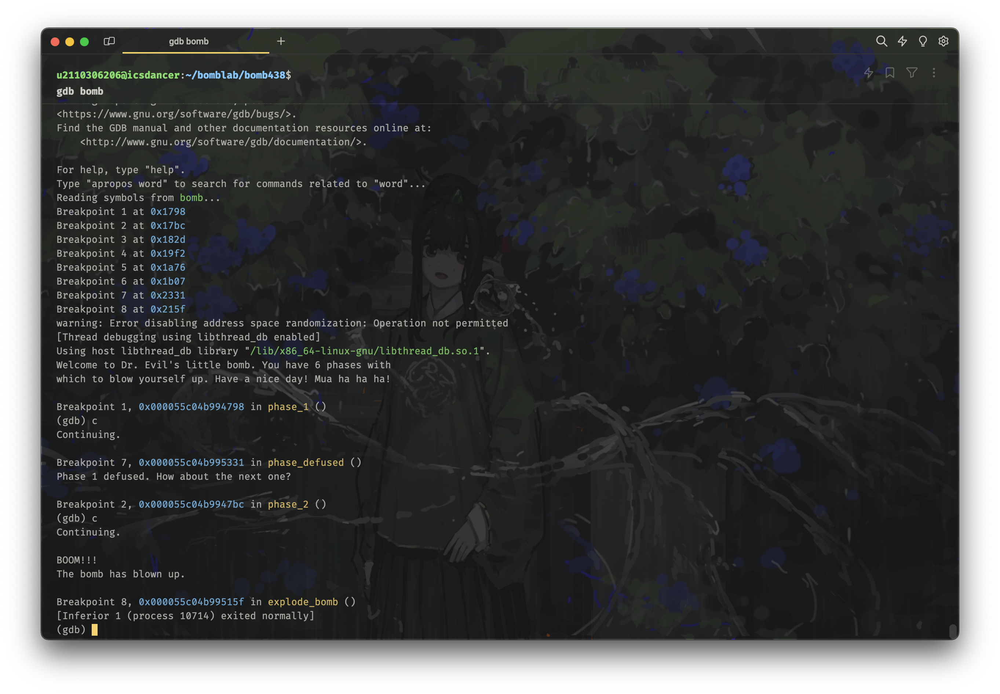

注：这里输入的 `psol.txt` 中，phase 1 的答案正确，而 phase 2 的答案错误。

于是我们可以看到，我们的炸弹现在即使被引爆，也不会通知到服务器（不然我这个超过 DDL 的尝试会直接导致程序终止），这下我们就可以放心地去拆弹了（而且但它依然能正确的打印爆炸信息供我们识别！）。

## Phase 1

首先，我们通过查找 `bomb.asm`，找到反编译出的 `phase_1` 函数的代码，然后阅读一下：

```asm
00000000000014e9 <main>:
    ...
    15b1:	e8 30 0c 00 00       	call   21e6 <read_line>
    15b6:	48 89 c7             	mov    %rax,%rdi
    15b9:	e8 da 01 00 00       	call   1798 <phase_1>
    15be:	48 89 df             	mov    %rbx,%rdi
    ...

0000000000001798 <phase_1>:
    1798:	f3 0f 1e fa          	endbr64
    179c:	48 83 ec 08          	sub    $0x8,%rsp
    17a0:	48 8d 35 69 2a 00 00 	lea    0x2a69(%rip),%rsi        # 4210 <_IO_stdin_used+0x210>
    17a7:	e8 0c 06 00 00       	call   1db8 <strings_not_equal>
    17ac:	85 c0                	test   %eax,%eax
    17ae:	75 05                	jne    17b5 <phase_1+0x1d>
    17b0:	48 83 c4 08          	add    $0x8,%rsp
    17b4:	c3                   	ret
    17b5:	e8 61 09 00 00       	call   211b <explode_bomb>
    17ba:	eb f4                	jmp    17b0 <phase_1+0x18>
```

考虑到这是大多数同学接触到的第一段汇编代码，所以我在此详细地介绍一下这段代码的含义。

1. `endbr64`：一句无关紧要的指令，用于防止 ROP 攻击，我们可以忽略它。

2. `sub $0x8,%rsp`：将栈指针（%rsp）向下移动 8 个字节，使得栈帧 16 字节对齐。

3. `lea 0x2a69(%rip),%rsi`：正如书上所提到的，`leaq` 指令全称为 `load effective address`，加载有效地址，但它并不会真的去访存然后再反算地址，它就是简单的把计算出来的地址放到你所需要的地方，所以它经常被用于做一些计算。

    这里的 `lea` 指令的含义是，将内存 `0x2a69(%rip)` 处的地址（也就是 `0x2a69 + 0x17a7 = 0x4210`）赋值给 `%rsi`。注意 `%rip` 这个东西的值不是它所处的这行代码的地址，而是下一条！同时，`%rsi` 代表的是函数运行的第二个参数。

    > 为什么 %rip 的值不是它所处的这行代码的地址，而是下一条？
    >
    > 当你学完第四章处理器体系结构的时候，你就会知道。
    >
    > 在这里做个简要的说明就是，当 CPU 读取并执行这条指令的时候，由于它已经读取完这条指令，所以 %rip 程序计数器的值已经指向了下一条指令的地址，而不是这条指令的地址。

4. `call 1db8 <strings_not_equal>`：调用 `strings_not_equal` 函数。也即首先将 `%rip` 的值（也就是下一条指令的值，`0x17ac`）压入栈中，然后跳转到 `strings_not_equal` 函数的地址处执行。注意这里由于我们从 `main` 函数到这里一直没有修改 `%rdi` （也就是存放第一个参数的寄存器）的值，所以我们传入的第一个参数实际上是 `main` 中 `read_line` 函数的返回值（见 `0x15b6` 处），也就是我们输入的字符串的地址。而第二个参数就是我们上一条指令传入的 `%rsi`，它的内容也是一个地址，指向内存 `0x2a69` 的位置。

5. `test %eax,%eax`：将 `%eax` 寄存器的值与其自身进行与运算，然后将结果存入 `%eax`。并且同时设置条件码（Condition Code），其中有一个叫做 `ZF` 的标志位，如果 `%eax` 的值为 0，则 `ZF` 为 1，否则为 0。

6. `jne 17b5 <phase_1+0x1d>`：`jne` 指令在上一条指令结果非 0 的情况下跳转，其具体的判断条件为 `ZF = 0`（这里可以参照书 P135 页，或者 3.6.1 章条件码），也就是说，如果 `ZF` 为 0（这对应我们调用 `strings_not_equal` 返回了一个非零值，代表我们没能成功匹配），则跳转到 `0x17b5` 的地方，也就是 `call explode_bomb` 的语句，进而引爆炸弹。

7. `add $0x8,%rsp`：只有当上一条指令没有跳走的情况下才会执行（这代表我们答对了）。将栈指针（%rsp）向上移动 8 个字节，恢复栈指针的位置。

8. `ret`：返回，将栈顶的值（也就是 `0x17ac`）赋值给 `%rip`，再将栈指针向上移动 8 个字节，恢复栈指针的位置，然后跳转到 `%rip` 所指向的地址处继续执行。相当于 `phase_1` 这个函数执行完毕，返回到 `main` 函数的 `0x15be` 处继续执行。

9. `call 211b <explode_bomb>`：调用 `explode_bomb` 函数，也是首先将 `%rip` 的值（也就是下一条指令的值，`0x17ba`）压入栈中，然后跳转到 `explode_bomb` 函数的地址处执行。当 `explode_bomb` 函数执行完毕后，会返回到下一条指令，也即 `0x17ba` 处继续执行。

10. `jmp 17b0 <phase_1+0x18>`：无条件跳转到 `0x17b0` 处，即进入（7）处，完成 `phase_1` 的退出流程，还原栈针，返回。

这里写的真的很细碎，但我还是觉得对于初学者而言可能恰恰需要的就是这种细碎的解释，所以如果你觉得你掌握的很好了，那你随便扫两眼就行了。

所以，我们得到了解决这个 phase 的关键信息，就是我们要使用 `gdb` 在执行 `call strings_not_equal` 之前，获取到 `%rsi` 的值（也就是正确答案），就可以了。

首先我们打开 `psol.txt`，随便输入一行字符串，比如

```txt
pku is better than thu
```

然后，我们打开 `gdb`，并且设置断点：

```bash
gdb bomb
# 先前的安全化操作，会自动使用 run 开始执行程序
# ...
# Breakpoint 1, 0x0000561abc562798 in phase_1 ()
# 打开 layout asm，可以看到反汇编出的代码
layout asm
# 在 call strings_not_equal 这句指令处（还未执行）设置断点
# 此时，上一条指令 leaq 已经执行完毕，%rsi 的值已经被赋值
# 也可以用 b *0x55ad99afc7a7 直接在具体的指令地址处设定断点
# 但是你会发现每次运行的时候，这个地址都不一样，都得重新复制黏贴一遍，所以还是用这种方式比较方便
b *(phase_1+15)
# 继续执行，会在上面设置的断点处停下来
c
# 打印 %rsi 指向的内存处的字符串
x/s $rsi
```

运行截图如下：

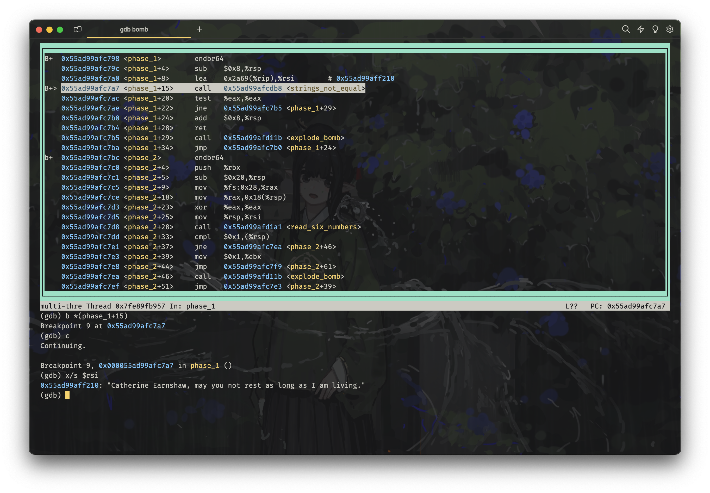

从而我们得到了 phase 1 的正确答案：

```text
Catherine Earnshaw, may you not rest as long as I am living.
```

使用两次 `Ctrl+D` （这标志着我们的输入结束，即 EOF ）退出 `gdb`，然后将正确答案写入到 `psol.txt` 第一行：

```text
Catherine Earnshaw, may you not rest as long as I am living.
pku is better than thu
```

然后重新运行程序：

```bash
gdb bomb
# Breakpoint 1, 0x0000557197168798 in phase_1 ()
# 我们已经有正确答案了，直接使用 finish 执行到 phase_1 函数返回
finish
# 继续执行 phase_defused 函数
c
```

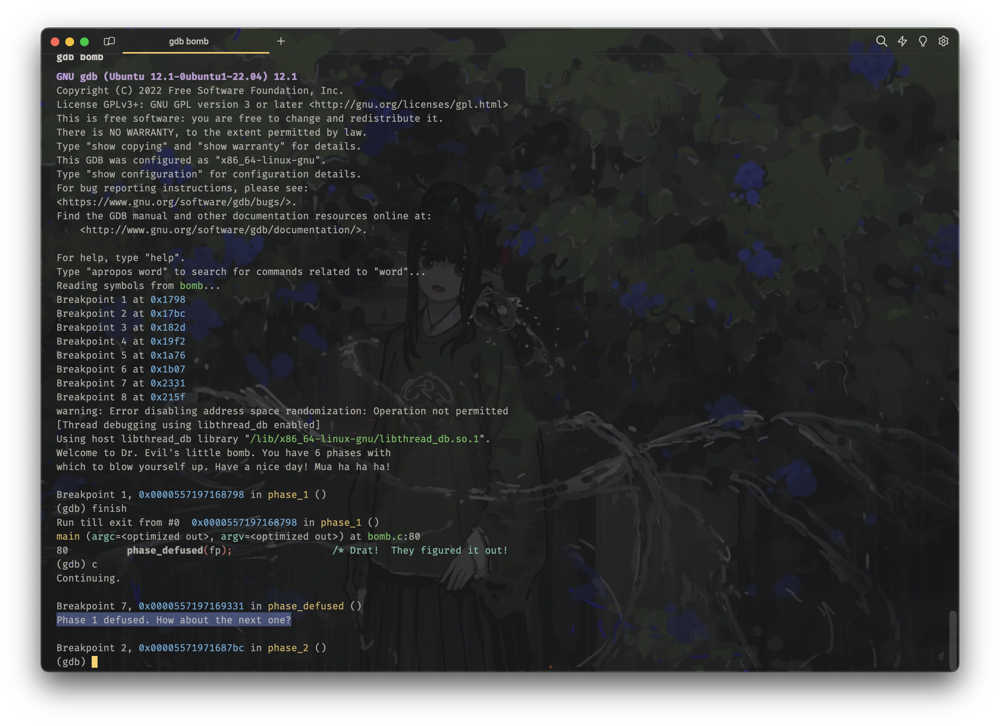

可以发现我们已经正常的从 `phase_1` 函数返回了，而没有进入 `send_msg` 函数，而是返回到 `bomb.c` 中的下一句 `phase_defused` 函数的执行处了。这就代表我们已经成功的完成了 phase 1。

由于我为了规避服务器超期检查，使用 `gdb` 跳过了 phase_defused 函数的执行，但你们如果前面没有做这个操作而是正常执行的话，那么服务器应该就会收到你的答案并更新 AutoLab 的成绩了。

可以看到，继续执行后就进入了 phase 2。

## Phase 2

依旧是先找到 `phase_2` 函数的代码：

```asm
00000000000017bc <phase_2>:
    17bc:	f3 0f 1e fa          	endbr64
    17c0:	53                   	push   %rbx
    17c1:	48 83 ec 20          	sub    $0x20,%rsp
    17c5:	64 48 8b 04 25 28 00 	mov    %fs:0x28,%rax
    17cc:	00 00
    17ce:	48 89 44 24 18       	mov    %rax,0x18(%rsp)
    17d3:	31 c0                	xor    %eax,%eax
    17d5:	48 89 e6             	mov    %rsp,%rsi
    17d8:	e8 c4 09 00 00       	call   21a1 <read_six_numbers>
    17dd:	83 3c 24 01          	cmpl   $0x1,(%rsp)
    17e1:	75 07                	jne    17ea <phase_2+0x2e>
    17e3:	bb 01 00 00 00       	mov    $0x1,%ebx
    17e8:	eb 0f                	jmp    17f9 <phase_2+0x3d>
    17ea:	e8 2c 09 00 00       	call   211b <explode_bomb>
    17ef:	eb f2                	jmp    17e3 <phase_2+0x27>
    17f1:	e8 25 09 00 00       	call   211b <explode_bomb>
    17f6:	83 c3 01             	add    $0x1,%ebx
    17f9:	83 fb 05             	cmp    $0x5,%ebx
    17fc:	7f 14                	jg     1812 <phase_2+0x56>
    17fe:	48 63 d3             	movslq %ebx,%rdx
    1801:	8d 43 ff             	lea    -0x1(%rbx),%eax
    1804:	48 98                	cltq
    1806:	8b 04 84             	mov    (%rsp,%rax,4),%eax
    1809:	01 c0                	add    %eax,%eax
    180b:	39 04 94             	cmp    %eax,(%rsp,%rdx,4)
    180e:	74 e6                	je     17f6 <phase_2+0x3a>
    1810:	eb df                	jmp    17f1 <phase_2+0x35>
    1812:	48 8b 44 24 18       	mov    0x18(%rsp),%rax
    1817:	64 48 33 04 25 28 00 	xor    %fs:0x28,%rax
    181e:	00 00
    1820:	75 06                	jne    1828 <phase_2+0x6c>
    1822:	48 83 c4 20          	add    $0x20,%rsp
    1826:	5b                   	pop    %rbx
    1827:	c3                   	ret
    1828:	e8 63 fa ff ff       	call   1290 <__stack_chk_fail@plt>
```

其实这段代码对于如今的我而言已经是非常简单的了，尽管我尽可能地以初学者的角度讲述，但是我还是可能会忘记一些当时的困惑，所以如果你有任何问题，欢迎在评论区或者 issue 中提出。

直接对着反汇编出来的代码在脑子里空想可能并不是一个很好的办法（除非你真的可以用你的大脑模拟出一台计算机来），所以我建议你找一张纸或者在 iPad 上用 GoodNotes 之类的软件画一下这段代码的流程图，并一行一行地标注，大概了解其运行逻辑后，再结合 `gdb` 来调试，我当时的笔记大概就长这样：

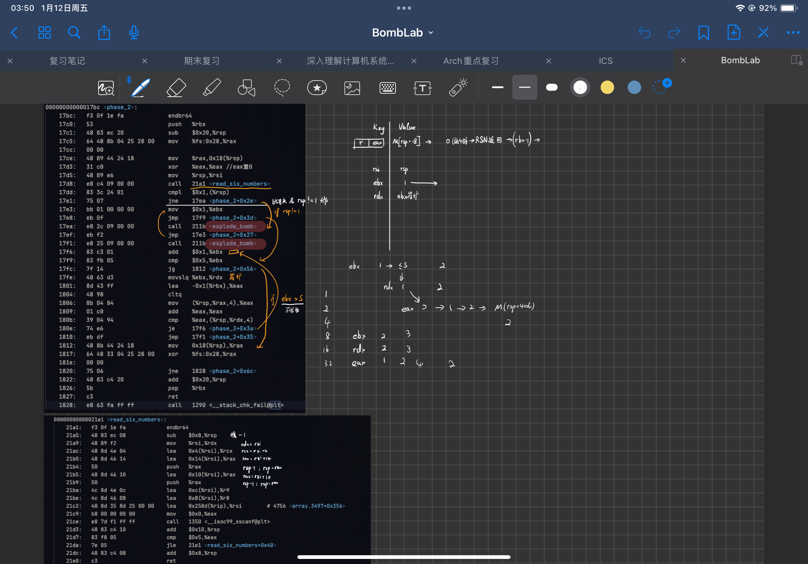

我们首先来阅读 `phase_2` 函数的代码。

```asm
00000000000017bc <phase_2>:
    17bc:	f3 0f 1e fa          	endbr64
    17c0:	53                   	push   %rbx
    17c1:	48 83 ec 20          	sub    $0x20,%rsp
    17c5:	64 48 8b 04 25 28 00 	mov    %fs:0x28,%rax                # 读取金丝雀值
    17cc:	00 00
    17ce:	48 89 44 24 18       	mov    %rax,0x18(%rsp)              # 将金丝雀值保存到栈中
    ...
    1812:	48 8b 44 24 18       	mov    0x18(%rsp),%rax
    1817:	64 48 33 04 25 28 00 	xor    %fs:0x28,%rax                # 校验金丝雀值
    181e:	00 00
    1820:	75 06                	jne    1828 <phase_2+0x6c>
    1822:	48 83 c4 20          	add    $0x20,%rsp
    1826:	5b                   	pop    %rbx
    1827:	c3                   	ret
    1828:	e8 63 fa ff ff       	call   1290 <__stack_chk_fail@plt>
```

这一段代码是一个很典型的函数开头，使用 `endbr64` 来防止 ROP 攻击，然后压栈 `%rbx`。

> 回忆一下， `%rbx` 是一个被调用者保存的寄存器，除了 `%rbx` 之外还有 `%rbp` 和 `%r12` 到 `%r15`，你可以通过 `%rbx` 和 `%rbp` 中的 b 是 Backup 的首字母来记忆，另外再强记一下 `%r12` 到 `%r15` 就行了。

接着再将 `%rsp` 栈针减去 `0x20`（注意是十六进制，也就是 32 个字节）扩大栈，然后使用 `mov %fs:0x28,%rax` 将 `%fs` 段寄存器中的 `0x28` 处的值（也就是 `0x28 + %fs` 处的值）赋值给 `%rax`，再复制到栈指针往上 24 个字节处（也就是 `%rsp + 0x18` 处）存储起来。

这代表了一个你在后续 Attack lab 中会遇到的东西，叫做 “金丝雀值（Canary Value）”，用于防止缓冲区溢出攻击（Buffer Overflow Attack）。这个值会在函数的结尾处进行校验，如果发现被修改了，就会抛出异常，阻止程序继续执行。

我们也可以看到，在函数的结尾处，会将 `%fs` 段寄存器中的 `0x28` 处的值（也就是 `0x28 + %fs` 处的值）赋值给 `%rax`，然后与之前保存在栈中的金丝雀值进行异或运算，如果结果不为 0，则说明金丝雀值被修改了，就会抛出异常，阻止程序继续执行（`call   1290 <__stack_chk_fail@plt>` 一句）。

> 为什么要使用 `fs` 段寄存器？
>
> 这是因为 `fs` 段寄存器是一个特殊的寄存器，它的值是由操作系统决定的，而不是由程序决定的，所以它的值是不会被修改的，这样就可以防止被恶意修改。

```asm
    17d3:	31 c0                	xor    %eax,%eax                    # 将 %eax 置零
    17d5:	48 89 e6             	mov    %rsp,%rsi                    # 将栈指针的值赋值给 %rsi
    17d8:	e8 c4 09 00 00       	call   21a1 <read_six_numbers>      # 调用 read_six_numbers 函数，读取六个数字
    17dd:	83 3c 24 01          	cmpl   $0x1,(%rsp)                  # 比较第一个数字是否为 1
    17e1:	75 07                	jne    17ea <phase_2+0x2e>          # 如果不是，跳转到 17ea 处，启动爆炸
    17e3:	bb 01 00 00 00       	mov    $0x1,%ebx                    # 将 %ebx 置 1
    17e8:	eb 0f                	jmp    17f9 <phase_2+0x3d>          # 跳转到 17f9 处，这是一个初始化的特判过程
    17ea:	e8 2c 09 00 00       	call   211b <explode_bomb>          # 爆炸，是 17e1 处的跳转目标
    17ef:	eb f2                	jmp    17e3 <phase_2+0x27>          # 跳转到 17e3 处，从而使得 %ebx 被置 1
    17f1:	e8 25 09 00 00       	call   211b <explode_bomb>          # 爆炸，是 17f9 处的跳转目标
    17f6:	83 c3 01             	add    $0x1,%ebx                    # 将 %ebx 加 1，作为循环中改变的变量
    17f9:	83 fb 05             	cmp    $0x5,%ebx                    # 比较 %ebx 是否为 5
    17fc:	7f 14                	jg     1812 <phase_2+0x56>          # 如果大于 5，跳转到 1812 处（这里未列出），也即进入函数结尾的金丝雀值校验过程
    17fe:	48 63 d3             	movslq %ebx,%rdx                    # 将 %ebx 的值赋值给 %rdx（使用符号扩展）
    1801:	8d 43 ff             	lea    -0x1(%rbx),%eax              # 将 %eax 赋值为 %ebx - 1
    1804:	48 98                	cltq                                # 将 %eax 的值赋值给 %rax（符号扩展到 64 位）
    1806:	8b 04 84             	mov    (%rsp,%rax,4),%eax           # 读出内存地址 %rsp + %rax * 4 处的值，赋值给 %eax
    1809:	01 c0                	add    %eax,%eax                    # 将 %eax 的值加到自身上，也就是乘 2
    180b:	39 04 94             	cmp    %eax,(%rsp,%rdx,4)           # 比较 %rsp + %rdx * 4 处的值（注意这里是 %rdx，是没有改变的循环变量）与 %eax 的值
    180e:	74 e6                	je     17f6 <phase_2+0x3a>          # 如果相等，跳转到 17f6 处，也即循环继续
    1810:	eb df                	jmp    17f1 <phase_2+0x35>          # 如果不相等，跳转到 17f1 处，也即爆炸
```

这段代码是 `phase_2` 的核心语句。我为它添加了额外的注释，希望能够方便大家理解。

这段代码是很经典的汇编循环语句，通过维护一个循环变量 `%ebx`，来控制循环的次数与计算每次访存的地址，它很类似于下面的 C 语言代码：

```c
int phase_2(int *rsp) {
    for (int ebx = 1; ebx <= 5; ebx++) {
        edx = ebx;
        eax = rsp[ebx - 1];
        eax *= 2;
        if (eax != rsp[ebx]) {
            explode_bomb();
        }
    }
    return 1;
}
```

注意一个 int 类型需要 4 个字节来存储，这就是为什么我们计算变址的时候要乘以比例因子 4。

尽管我们现在已经知道了核心的代码逻辑，但是我们还有一件事情不确定，那就是 `read_six_numbers` 函数的具体实现。它决定了读入的六个数字是如何被存储的，所以我们还是需要阅读一下它的代码：

```asm
00000000000021a1 <read_six_numbers>:
    21a1:	f3 0f 1e fa          	endbr64
    21a5:	48 83 ec 08          	sub    $0x8,%rsp                    # 扩大栈空间
    21a9:	48 89 f2             	mov    %rsi,%rdx                    # 将 %rsi 的值赋给 %rdx
    21ac:	48 8d 4e 04          	lea    0x4(%rsi),%rcx               # 计算 %rsi+4 的地址，存入 %rcx
    21b0:	48 8d 46 14          	lea    0x14(%rsi),%rax              # 计算 %rsi+20 的地址（也就是偏移 5 个 int），存入 %rax
    21b4:	50                   	push   %rax                         # 将 %rax 的值压栈
    21b5:	48 8d 46 10          	lea    0x10(%rsi),%rax              # 计算 %rsi+16 的地址，存入 %rax
    21b9:	50                   	push   %rax                         # 将 %rax 的值压栈
    21ba:	4c 8d 4e 0c          	lea    0xc(%rsi),%r9                # 计算 %rsi+12 的地址，存入 %r9
    21be:	4c 8d 46 08          	lea    0x8(%rsi),%r8                # 计算 %rsi+8 的地址，存入 %r8
    21c2:	48 8d 35 8d 25 00 00 	lea    0x258d(%rip),%rsi            # 计算当前指令指针 %rip+0x258d 的地址，存入 %rsi
    21c9:	b8 00 00 00 00       	mov    $0x0,%eax                    # 将 0 赋值给 %eax
    21ce:	e8 7d f1 ff ff       	call   1350 <__isoc99_sscanf@plt>   # 调用 sscanf 函数
    21d3:	48 83 c4 10          	add    $0x10,%rsp                   # 回收栈空间
    21d7:	83 f8 05             	cmp    $0x5,%eax                    # 比较 %eax 与 5，确定 sscanf 函数是否成功读入 6 个数字
    21da:	7e 05                	jle    21e1 <read_six_numbers+0x40> # 如果 %eax 小于等于 5，跳转到 21e1，也即引爆炸弹
    21dc:	48 83 c4 08          	add    $0x8,%rsp                    # 回收栈空间
    21e0:	c3                   	ret                                 # 返回
    21e1:	e8 35 ff ff ff       	call   211b <explode_bomb>          # 调用 explode_bomb 函数

```

回忆一下 `sscanf` 函数的签名：

```c
int sscanf(const char *str, const char *format, ...);
```

-   `str`：指向要读取的字符串。
-   `format`：指定输入格式控制。
-   `...`：可变数量的额外参数，用于存储从 `str` 中按照 `format` 指定的格式提取出的数据。

返回值：成功返回成功匹配并赋值的数据项个数。

还是谨记 x86 的函数调用约定：

-   `%rdi`：第一个参数
-   `%rsi`：第二个参数
-   `%rdx`：第三个参数
-   `%rcx`：第四个参数
-   `%r8`：第五个参数
-   `%r9`：第六个参数
-   `%rax`：返回值

超出六个参数的部分，会被压入栈中。压栈顺序为从右到左，注意 **栈是向下增长** 的，所以第七个参数（也就是第一个开始不能被寄存器传递的参数）会被压在最下方（见课本图 3.25）：

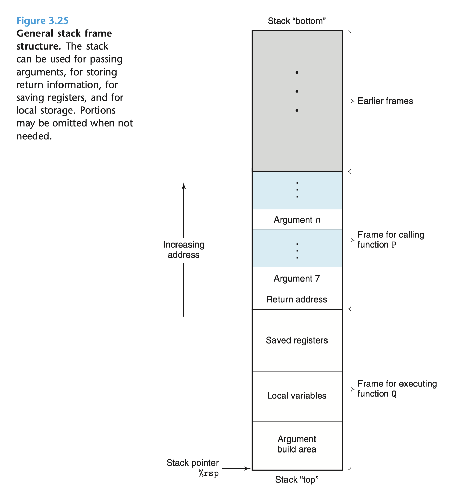

这里我们可以看到，调用 `sscanf` 函数的时候，我们传入了 7 个参数，其中前 6 个参数都是通过寄存器传递的，`%rdi` 是从 `main` 函数继承来的指向我们输入字符串的指针，`%rsi` 指向一个相对于 `%rip` 定位的字符串（这里你们会在第七章链接的地方学到，是一个重定向），指向一个应该是 `"%d %d %d %d %d %d"` 的字符串，然后 `%rdx` 到 `%r9` 以及计算后压栈的 `%rax` 分别是指向我们要存储的六个数字的地址。

我们可以在 `gdb` 中使用 `x/s $rsi` 来查看 `%rsi` 指向的字符串，验证我们的猜想：

```bash
gdb bomb
# ...
layout asm
layout regs

# 在 call sscanf 之前设置断点
b *(phase_2+28)
c
# 继续执行一步，进入 sscanf 函数
si

# 在修改 %rsi 的语句 lea    0x258d(%rip),%rsi 之后设置断点
b *(read_six_numbers+40)
c

# 打印此时的 %rsi 指向的字符串
x/s $rsi
```

果不其然：

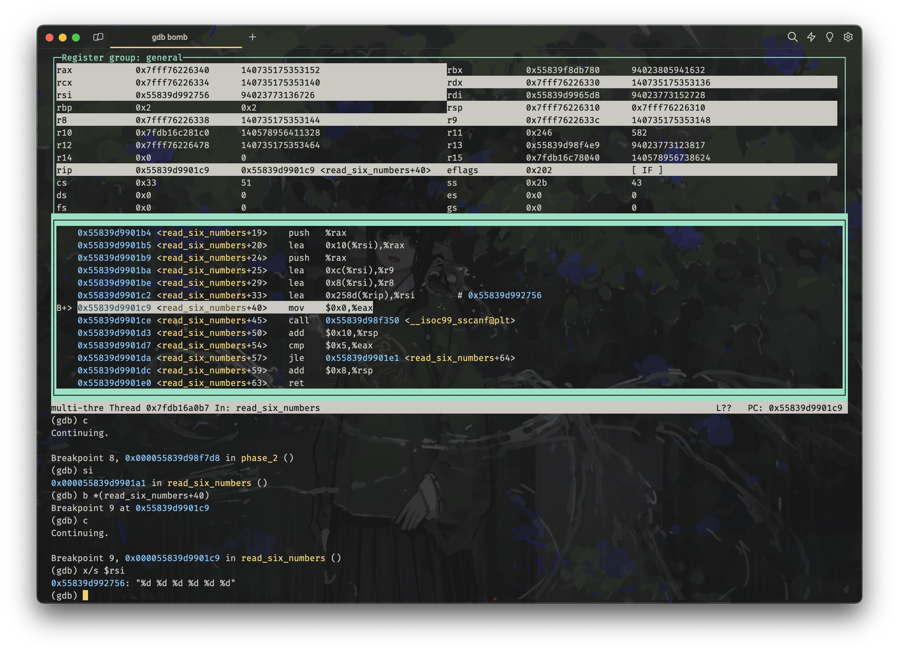

观察读入的顺序，`%rdx` 的值为 `%rsi`，也就是我们在 `phase_2` 中调用 `read_six_numbers` 函数时传入的 `%rsp`，即栈指针，这里会存放第 1 个读入的数字，然后以此类推依次向上存入后续的五个数字。

现在，我们已经彻底搞清楚了 `phase_2` 的逻辑：它调用 `read_six_numbers` 读入 6 个数字，将第 1 个数字存在栈顶，然后依次向上存储其余的 5 个数字，随后开启一个循环，首先对比第一个数字是否为 1，然后对比五次下一个数字是否为前一个数字的两倍，如果不是，就爆炸。

于是我们得到 phase 2 的答案：

```text
1 2 4 8 16 32
```

将其写入 `psol.txt` 的第二行：

```text
Catherine Earnshaw, may you not rest as long as I am living.
1 2 4 8 16 32
pku is better than thu
```

然后重新使用 `gdb` 运行程序，记得先在 `.gdbinit` 中注释掉 `b phase_1` 这个我们已经不需要的断点：

```bash
gdb bomb
# Breakpoint 1, 0x00005604243337bc in phase_2 ()
# 我们已经有正确答案了，直接使用 finish 或者 c 执行
c
```

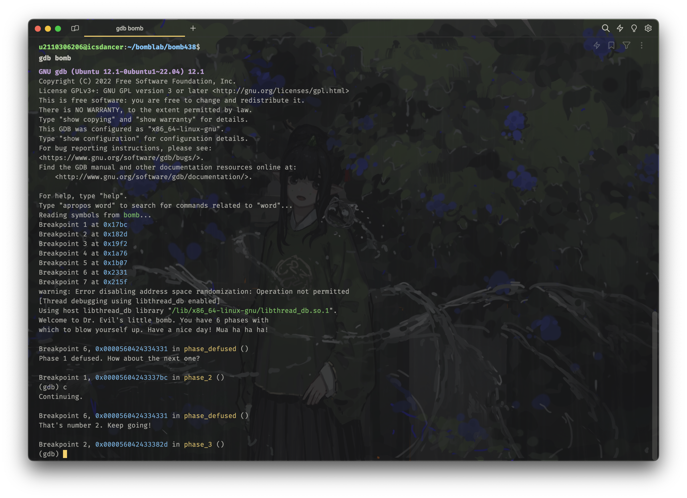

成功通过第二关！

> Congratulations!
>
> 如果一切顺利的话，你甚至可以像我一样完全不借助 gdb 查看寄存器和内存的变化状况，仅仅通过阅读反汇编出来的代码就能够完成这个任务！
>
> 这种阅读能力是你必须要训练的，因为考试的时候你是没有办法使用 gdb 的，所以你必须要能够在没有调试器的情况下，通过阅读汇编代码来理解程序的运行逻辑。

## Phase 3

phase 3 的反汇编代码看起来长的可怕：

```asm
000000000000182d <phase_3>:
    182d:	f3 0f 1e fa          	endbr64
    1831:	48 83 ec 28          	sub    $0x28,%rsp
    1835:	64 48 8b 04 25 28 00 	mov    %fs:0x28,%rax
    183c:	00 00
    183e:	48 89 44 24 18       	mov    %rax,0x18(%rsp)
    1843:	31 c0                	xor    %eax,%eax
    1845:	48 8d 4c 24 0f       	lea    0xf(%rsp),%rcx
    184a:	48 8d 54 24 10       	lea    0x10(%rsp),%rdx
    184f:	4c 8d 44 24 14       	lea    0x14(%rsp),%r8
    1854:	48 8d 35 4a 29 00 00 	lea    0x294a(%rip),%rsi        # 41a5 <_IO_stdin_used+0x1a5>
    185b:	e8 f0 fa ff ff       	call   1350 <__isoc99_sscanf@plt>
    1860:	83 f8 02             	cmp    $0x2,%eax
    1863:	7e 20                	jle    1885 <phase_3+0x58>
    1865:	8b 44 24 10          	mov    0x10(%rsp),%eax
    1869:	83 f8 07             	cmp    $0x7,%eax
    186c:	0f 87 14 01 00 00    	ja     1986 <phase_3+0x159>
    1872:	89 c0                	mov    %eax,%eax
    1874:	48 8d 15 65 2b 00 00 	lea    0x2b65(%rip),%rdx        # 43e0 <_IO_stdin_used+0x3e0>
    187b:	48 63 04 82          	movslq (%rdx,%rax,4),%rax
    187f:	48 01 d0             	add    %rdx,%rax
    1882:	3e ff e0             	notrack jmp *%rax
    1885:	e8 91 08 00 00       	call   211b <explode_bomb>
    188a:	eb d9                	jmp    1865 <phase_3+0x38>
    188c:	81 7c 24 14 ce 01 00 	cmpl   $0x1ce,0x14(%rsp)
    1893:	00
    1894:	75 0a                	jne    18a0 <phase_3+0x73>
    1896:	b8 79 00 00 00       	mov    $0x79,%eax
    189b:	e9 f0 00 00 00       	jmp    1990 <phase_3+0x163>
    18a0:	e8 76 08 00 00       	call   211b <explode_bomb>
    18a5:	b8 79 00 00 00       	mov    $0x79,%eax
    18aa:	e9 e1 00 00 00       	jmp    1990 <phase_3+0x163>
    18af:	83 7c 24 14 40       	cmpl   $0x40,0x14(%rsp)
    18b4:	75 0a                	jne    18c0 <phase_3+0x93>
    18b6:	b8 61 00 00 00       	mov    $0x61,%eax
    18bb:	e9 d0 00 00 00       	jmp    1990 <phase_3+0x163>
    18c0:	e8 56 08 00 00       	call   211b <explode_bomb>
    18c5:	b8 61 00 00 00       	mov    $0x61,%eax
    18ca:	e9 c1 00 00 00       	jmp    1990 <phase_3+0x163>
    18cf:	81 7c 24 14 e5 02 00 	cmpl   $0x2e5,0x14(%rsp)
    18d6:	00
    18d7:	75 0a                	jne    18e3 <phase_3+0xb6>
    18d9:	b8 65 00 00 00       	mov    $0x65,%eax
    18de:	e9 ad 00 00 00       	jmp    1990 <phase_3+0x163>
    18e3:	e8 33 08 00 00       	call   211b <explode_bomb>
    18e8:	b8 65 00 00 00       	mov    $0x65,%eax
    18ed:	e9 9e 00 00 00       	jmp    1990 <phase_3+0x163>
    18f2:	81 7c 24 14 55 03 00 	cmpl   $0x355,0x14(%rsp)
    18f9:	00
    18fa:	75 0a                	jne    1906 <phase_3+0xd9>
    18fc:	b8 6b 00 00 00       	mov    $0x6b,%eax
    1901:	e9 8a 00 00 00       	jmp    1990 <phase_3+0x163>
    1906:	e8 10 08 00 00       	call   211b <explode_bomb>
    190b:	b8 6b 00 00 00       	mov    $0x6b,%eax
    1910:	eb 7e                	jmp    1990 <phase_3+0x163>
    1912:	81 7c 24 14 90 00 00 	cmpl   $0x90,0x14(%rsp)
    1919:	00
    191a:	75 07                	jne    1923 <phase_3+0xf6>
    191c:	b8 6e 00 00 00       	mov    $0x6e,%eax
    1921:	eb 6d                	jmp    1990 <phase_3+0x163>
    1923:	e8 f3 07 00 00       	call   211b <explode_bomb>
    1928:	b8 6e 00 00 00       	mov    $0x6e,%eax
    192d:	eb 61                	jmp    1990 <phase_3+0x163>
    192f:	81 7c 24 14 57 02 00 	cmpl   $0x257,0x14(%rsp)
    1936:	00
    1937:	75 07                	jne    1940 <phase_3+0x113>
    1939:	b8 6a 00 00 00       	mov    $0x6a,%eax
    193e:	eb 50                	jmp    1990 <phase_3+0x163>
    1940:	e8 d6 07 00 00       	call   211b <explode_bomb>
    1945:	b8 6a 00 00 00       	mov    $0x6a,%eax
    194a:	eb 44                	jmp    1990 <phase_3+0x163>
    194c:	81 7c 24 14 62 03 00 	cmpl   $0x362,0x14(%rsp)
    1953:	00
    1954:	75 07                	jne    195d <phase_3+0x130>
    1956:	b8 71 00 00 00       	mov    $0x71,%eax
    195b:	eb 33                	jmp    1990 <phase_3+0x163>
    195d:	e8 b9 07 00 00       	call   211b <explode_bomb>
    1962:	b8 71 00 00 00       	mov    $0x71,%eax
    1967:	eb 27                	jmp    1990 <phase_3+0x163>
    1969:	81 7c 24 14 e6 01 00 	cmpl   $0x1e6,0x14(%rsp)
    1970:	00
    1971:	75 07                	jne    197a <phase_3+0x14d>
    1973:	b8 78 00 00 00       	mov    $0x78,%eax
    1978:	eb 16                	jmp    1990 <phase_3+0x163>
    197a:	e8 9c 07 00 00       	call   211b <explode_bomb>
    197f:	b8 78 00 00 00       	mov    $0x78,%eax
    1984:	eb 0a                	jmp    1990 <phase_3+0x163>
    1986:	e8 90 07 00 00       	call   211b <explode_bomb>
    198b:	b8 76 00 00 00       	mov    $0x76,%eax
    1990:	38 44 24 0f          	cmp    %al,0xf(%rsp)
    1994:	75 15                	jne    19ab <phase_3+0x17e>
    1996:	48 8b 44 24 18       	mov    0x18(%rsp),%rax
    199b:	64 48 33 04 25 28 00 	xor    %fs:0x28,%rax
    19a2:	00 00
    19a4:	75 0c                	jne    19b2 <phase_3+0x185>
    19a6:	48 83 c4 28          	add    $0x28,%rsp
    19aa:	c3                   	ret
    19ab:	e8 6b 07 00 00       	call   211b <explode_bomb>
    19b0:	eb e4                	jmp    1996 <phase_3+0x169>
    19b2:	e8 d9 f8 ff ff       	call   1290 <__stack_chk_fail@plt>
```

> 从这个 phase 起，我将不再提供反汇编代码的逐行注释，这并不是因为我懒 ~~好吧我承认，其实有点~~，而是因为我希望你们经过前两个 phase 的详细讲解，能够学会独立地阅读反汇编代码。

看上去的确很可怕，但我们稍加阅读就可以发现，其中有很多结构十分相同的语句，稍加分析就会发现，其在最开始依旧是使用 `sscanf` 函数来读入了三个东西（依次设置了 `%rdx`、`%rcx`、`%r8` 指向栈针上面的特定的位置），通过如下代码可以获得 `%rsi` 指向的格式字符串（仍旧记得先注释掉我们已经完成的 `.gdbinit` 中的 `b phase_2` 断点）：

```bash
gdb bomb
layout asm
layout regs
# 在修改 %rsi 的语句 lea    0x294a(%rip),%rsi 之后设置断点
# 也即 call sscanf 之前
b *(phase_3+46)
c
# 打印此时的 %rsi 指向的字符串
x/s $rsi
```

得到输出如下：

```text
(gdb) x/s $rsi
0x558adaa221a5: "%d %c %d"
```

于是我们确定了，我们要输入的是一个数字、一个字符、一个数字：

-   `0x10(%rsp)`：为 `%rdx` 寄存器指向的位置，`%rdx` 寄存器储存第三个参数，因而是第一个存储的数字
-   `0x14(%rsp)`：为 `%r8` 寄存器指向的位置，`%r8` 寄存器储存第五个参数，因而是第三个存储的数字
-   `0x18(%rsp)`：为 `%rcx` 寄存器指向的位置，`%rcx` 寄存器储存第四个参数，因而是第二个存储的字符

继续阅读源码：

```asm
    1869:	83 f8 07             	cmp    $0x7,%eax
    186c:	0f 87 14 01 00 00    	ja     1986 <phase_3+0x159>
    1872:	89 c0                	mov    %eax,%eax
    1874:	48 8d 15 65 2b 00 00 	lea    0x2b65(%rip),%rdx        # 43e0 <_IO_stdin_used+0x3e0>
    187b:	48 63 04 82          	movslq (%rdx,%rax,4),%rax
    187f:	48 01 d0             	add    %rdx,%rax
    1882:	3e ff e0             	notrack jmp *%rax
```

我们发现读入后，存在一个校验，将 `%rsp + 0x10` 处的值（也就是我们输入的第一个数字）与 7 进行比较，如果大于 7，就会跳转到 `phase_3+0x159` 处，也就是爆炸。

所以第一个数字必须小于等于 7。

接着，这里又一次相对 PC 进行了一个引用，存入 `%rdx`，再将 `%rdx + %rax * 4` 处的值赋值给 `%rax`，接着使用一个间接跳转，跳转到 `%rax` 处执行。

再结合我们之前发现的代码具有很强的结构相似性，我们可以猜测，这里的代码应该是一个 `switch` 语句，根据我们输入的第一个数字，跳转到不同的位置执行。

接下来的事情就好办了。随便输入一个符合的字符串，然后观察一下代码会跳到哪里继续执行，然后我们就只用分析那一块的代码就可以了。

在这里，我选择的输入是：

```text
6 a 213
```

> 注：213 是 CSAPP 的 CMU 课程号～

将之加入到 `psol.txt` 的第三行：

```text
Catherine Earnshaw, may you not rest as long as I am living.
1 2 4 8 16 32
6 a 213
pku is better than thu
```

然后重新使用 `gdb` 运行程序：

```bash
gdb bomb
layout asm
layout regs
# 在跳转语句 notrack jmp *%rax 之前设置断点
b *(phase_3+85)
c
```


观察到我们跳转到了 `194c` 这里（以代码检索，不要以地址检索，因为地址随机化了）：

```asm
    194c:	81 7c 24 14 62 03 00 	cmpl   $0x362,0x14(%rsp)
    1953:	00
    1954:	75 07                	jne    195d <phase_3+0x130>
    1956:	b8 71 00 00 00       	mov    $0x71,%eax
    195b:	eb 33                	jmp    1990 <phase_3+0x163>
    195d:	e8 b9 07 00 00       	call   211b <explode_bomb>
    1962:	b8 71 00 00 00       	mov    $0x71,%eax
    1967:	eb 27                	jmp    1990 <phase_3+0x163>
```

回顾一下之前准备 `sscanf` 的参数的时候，我们知道 `0x14(%rsp)` 是指向我们输入的第三个数字的，所以这里的代码是在比较我们输入的第三个数字是否为 `0x362`，稍加计算便知道， `0x362` 是十进制的 866，所以这里的代码是在比较我们输入的第三个数字是否为 `866`，如果不是，就爆炸。

如果这个语句发现匹配的话，那么会继续执行 `1956` 处的代码，将 `%eax` 置为 `0x71`，然后跳转到 `1990` 处。

```asm
    1990:	38 44 24 0f          	cmp    %al,0xf(%rsp)
    1994:	75 15                	jne    19ab <phase_3+0x17e>
    1996:	48 8b 44 24 18       	mov    0x18(%rsp),%rax
    199b:	64 48 33 04 25 28 00 	xor    %fs:0x28,%rax
    19a2:	00 00
    19a4:	75 0c                	jne    19b2 <phase_3+0x185>
    19a6:	48 83 c4 28          	add    $0x28,%rsp
    19aa:	c3                   	ret
    19ab:	e8 6b 07 00 00       	call   211b <explode_bomb>
    19b0:	eb e4                	jmp    1996 <phase_3+0x169>
    19b2:	e8 d9 f8 ff ff       	call   1290 <__stack_chk_fail@plt>
```

继续阅读 `1990` 处的代码，我们发现，这里又是一个校验，将 `0xf(%rsp)` 处的值（也就是我们输入的第二个字符）与 `%al`（对应于 `%rax` 的低 8 位）进行比较，如果不相等，就爆炸。

而稍加转换，就知道 `%al` 的值为 `0x71`，也就是 `q`，所以这里的代码是在比较我们输入的第二个字符是否为 `q`。

从而我们得到了 phase 3 的答案（之一）：

```text
6 q 866
```

将其写入 `psol.txt` 的第三行：

```text
Catherine Earnshaw, may you not rest as long as I am living.
1 2 4 8 16 32
6 q 866
pku is better than thu
```

然后重新使用 `gdb` 运行程序：

```bash
gdb bomb
c
```

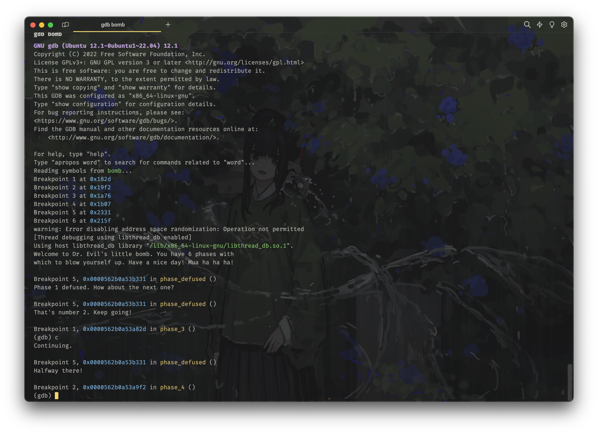

成功通过第三关！

## Phase 4

phase 4 的代码量看起来就正常多了：

```asm
00000000000019f2 <phase_4>:
    19f2:	f3 0f 1e fa          	endbr64
    19f6:	55                   	push   %rbp
    19f7:	53                   	push   %rbx
    19f8:	48 83 ec 18          	sub    $0x18,%rsp
    19fc:	64 48 8b 04 25 28 00 	mov    %fs:0x28,%rax
    1a03:	00 00
    1a05:	48 89 44 24 08       	mov    %rax,0x8(%rsp)
    1a0a:	31 c0                	xor    %eax,%eax
    1a0c:	48 8d 4c 24 04       	lea    0x4(%rsp),%rcx
    1a11:	48 89 e2             	mov    %rsp,%rdx
    1a14:	48 8d 35 47 2d 00 00 	lea    0x2d47(%rip),%rsi        # 4762 <array.3497+0x362>
    1a1b:	e8 30 f9 ff ff       	call   1350 <__isoc99_sscanf@plt>
    1a20:	83 f8 02             	cmp    $0x2,%eax
    1a23:	75 06                	jne    1a2b <phase_4+0x39>
    1a25:	83 3c 24 05          	cmpl   $0x5,(%rsp)
    1a29:	74 05                	je     1a30 <phase_4+0x3e>
    1a2b:	e8 eb 06 00 00       	call   211b <explode_bomb>
    1a30:	bd 00 00 00 00       	mov    $0x0,%ebp
    1a35:	bb 00 00 00 00       	mov    $0x0,%ebx
    1a3a:	39 1c 24             	cmp    %ebx,(%rsp)
    1a3d:	7e 0e                	jle    1a4d <phase_4+0x5b>
    1a3f:	89 df                	mov    %ebx,%edi
    1a41:	e8 71 ff ff ff       	call   19b7 <func4>
    1a46:	01 c5                	add    %eax,%ebp
    1a48:	83 c3 01             	add    $0x1,%ebx
    1a4b:	eb ed                	jmp    1a3a <phase_4+0x48>
    1a4d:	39 6c 24 04          	cmp    %ebp,0x4(%rsp)
    1a51:	75 17                	jne    1a6a <phase_4+0x78>
    1a53:	48 8b 44 24 08       	mov    0x8(%rsp),%rax
    1a58:	64 48 33 04 25 28 00 	xor    %fs:0x28,%rax
    1a5f:	00 00
    1a61:	75 0e                	jne    1a71 <phase_4+0x7f>
    1a63:	48 83 c4 18          	add    $0x18,%rsp
    1a67:	5b                   	pop    %rbx
    1a68:	5d                   	pop    %rbp
    1a69:	c3                   	ret
    1a6a:	e8 ac 06 00 00       	call   211b <explode_bomb>
    1a6f:	eb e2                	jmp    1a53 <phase_4+0x61>
    1a71:	e8 1a f8 ff ff       	call   1290 <__stack_chk_fail@plt>
```

依旧是老规矩，首先注释掉 `.gdbinit` 中的 `b phase_3` 断点，然后使用 `gdb` 运行程序

```bash
gdb bomb
layout asm
layout regs
# 在 call sscanf 这句设置断点（也即执行 call sscanf 之前）
b *(phase_4+27)
c
# 打印此时的 %rsi 指向的字符串，获得输入的格式
x/s $rsi
```

得到输出：

```text
(gdb) x/s $rsi
0x562b0a53d762: "%d %d"
```

从而我们知道，我们需要输入两个数字。根据代码，我们知道，第一个数字会被存储在 `%rsp + 0x0` 处，第二个数字会被存储在 `%rsp + 0x4` 处。

继续阅读代码：

```asm
    1a25:	83 3c 24 05          	cmpl   $0x5,(%rsp)
    1a29:	74 05                	je     1a30 <phase_4+0x3e>
    1a2b:	e8 eb 06 00 00       	call   211b <explode_bomb>
    1a30:	bd 00 00 00 00       	mov    $0x0,%ebp
    1a35:	bb 00 00 00 00       	mov    $0x0,%ebx
    1a3a:	39 1c 24             	cmp    %ebx,(%rsp)
    1a3d:	7e 0e                	jle    1a4d <phase_4+0x5b>
    1a3f:	89 df                	mov    %ebx,%edi
    1a41:	e8 71 ff ff ff       	call   19b7 <func4>
    1a46:	01 c5                	add    %eax,%ebp
    1a48:	83 c3 01             	add    $0x1,%ebx
    1a4b:	eb ed                	jmp    1a3a <phase_4+0x48>
    1a4d:	39 6c 24 04          	cmp    %ebp,0x4(%rsp)
    1a51:	75 17                	jne    1a6a <phase_4+0x78>
    1a53:	48 8b 44 24 08       	mov    0x8(%rsp),%rax
    1a58:	64 48 33 04 25 28 00 	xor    %fs:0x28,%rax
    1a5f:	00 00
    1a61:	75 0e                	jne    1a71 <phase_4+0x7f>
    1a63:	48 83 c4 18          	add    $0x18,%rsp
    1a67:	5b                   	pop    %rbx
    1a68:	5d                   	pop    %rbp
    1a69:	c3                   	ret
    1a6a:	e8 ac 06 00 00       	call   211b <explode_bomb>
    1a6f:	eb e2                	jmp    1a53 <phase_4+0x61>
    1a71:	e8 1a f8 ff ff       	call   1290 <__stack_chk_fail@plt>
```

我们发现程序首先检验了 `%rsp` 处的值是否为 5，如果不是，就爆炸。

随后，通过两句 `mov` 指令，将 `%ebp` 和 `%ebx` 置为 0，然后比较 `%ebx` 和 `(%rsp)` 处的值。

如果 `(%rsp)` 处的值小于等于 `%ebx`，就跳转到 `1a4d` 处，这代表了这个循环的跳出。然后它会继续继续比较 `%ebp` 和 `0x4(%rsp)` 处的值（也就是我们输入第二个参数），如果不相等，就爆炸。

如果不是的话，就将 `%ebx` 的值赋值给 `%edi`（代表第一个参数），然后调用 `func4` 函数，将返回值加到 `%ebp` 上，然后将 `%ebx` 加 1（从这里可以看出这个是一个循环标记），然后跳转到 `1a3a` 处，也就是继续比较 `%ebx` 和 `(%rsp)` 处的值。

从而我们可以大致得到 `func4` 函数的逻辑：

```c
int phase_4(int a, int b) {
    if (a != 5){
        explode_bomb();
    }
    int ebp = 0;
    for (int ebx = 0; ebx < a; ebx++) {
        ebp += func4(ebx);
    }
    if (ebp != b) {
        explode_bomb();
    }
}
```

那么接下来的关键，就是分析 `func4` 函数的逻辑，并确定对于它的返回值累积 5 次后，会得到一个什么样的值。

```asm
00000000000019b7 <func4>:
    19b7:	f3 0f 1e fa          	endbr64
    19bb:	85 ff                	test   %edi,%edi
    19bd:	7e 29                	jle    19e8 <func4+0x31>
    19bf:	55                   	push   %rbp
    19c0:	53                   	push   %rbx
    19c1:	48 83 ec 08          	sub    $0x8,%rsp
    19c5:	89 fb                	mov    %edi,%ebx
    19c7:	83 ff 01             	cmp    $0x1,%edi
    19ca:	74 22                	je     19ee <func4+0x37>
    19cc:	8d 7f ff             	lea    -0x1(%rdi),%edi
    19cf:	e8 e3 ff ff ff       	call   19b7 <func4>
    19d4:	8d 2c 00             	lea    (%rax,%rax,1),%ebp
    19d7:	8d 7b fe             	lea    -0x2(%rbx),%edi
    19da:	e8 d8 ff ff ff       	call   19b7 <func4>
    19df:	01 e8                	add    %ebp,%eax
    19e1:	48 83 c4 08          	add    $0x8,%rsp
    19e5:	5b                   	pop    %rbx
    19e6:	5d                   	pop    %rbp
    19e7:	c3                   	ret
    19e8:	b8 00 00 00 00       	mov    $0x0,%eax
    19ed:	c3                   	ret
    19ee:	89 f8                	mov    %edi,%eax
    19f0:	eb ef                	jmp    19e1 <func4+0x2a>
```

我们发现，这个函数首先检查了 `%edi` 的值是否小于等于 0，如果是的话，就返回 0。

如果不是的话，它会先保存（压栈）两个被调用者保存的寄存器 `%rbp` 和 `%rbx`，然后将 `%edi` 的值赋值给 `%ebx`（保存初始传入的参数），接着比较 `%edi` 和 1 的大小，判断 `%edi` 是否为 1。

如果是的话，就跳转到 `19ee` 处，将 `%edi` 的值赋值给 `%eax`，再跳回到 `19e1` 处，完成对于被调用者保存的寄存器的恢复（弹栈），然后返回。

如果不是的话，就将 `%edi` 减 1，然后调用 `func4` 函数，使用返回值 `%rax` 计算一个 `%rax + %rax` ，也就是 `2 * func(%edi - 1)`，存入 `%ebp`。

接着，它将 `%ebx` 减 2，然后再次调用 `func4` 函数，把新的返回值 `%rax` 又一次加到 `%ebp` 上。

最后，它会弹栈，恢复 `%rbx` 和 `%rbp` 的值，然后返回 `%eax`。

于是我们可以得到 `func4` 函数的逻辑：

```c
int func4(int a) {
    if (a <= 0) {
        return 0;
    }
    if (a == 1) {
        return a;
    }
    return 2 * func4(a - 1) + func4(a - 2);
}
```

从而我们得到这个函数的函数表：

| a   | func4(a) |
| --- | -------- |
| 0   | 0        |
| 1   | 1        |
| 2   | 2        |
| 3   | 5        |
| 4   | 12       |

从而我们可以得到，这个 phase 4 中累积 5 次调用 `func4` 函数得到的 `%ebp` 的值应该为 20。

> 其实这里还有一个取巧的办法，就是我们完全不用分析 `func4` 函数的逻辑，而是直接使用 `gdb` 在 `cmp    %ebp,0x4(%rsp)` 这一句比较的时候，打印出来 `%ebp` 的值即可。

最终，我们可以得到 phase 4 的答案：

```text
5 20
```

将其写入 `psol.txt` 的第四行：

```text
Catherine Earnshaw, may you not rest as long as I am living.
1 2 4 8 16 32
6 q 866
5 20
pku is better than thu
```

然后重新使用 `gdb` 运行程序：

```bash
gdb bomb
c
```

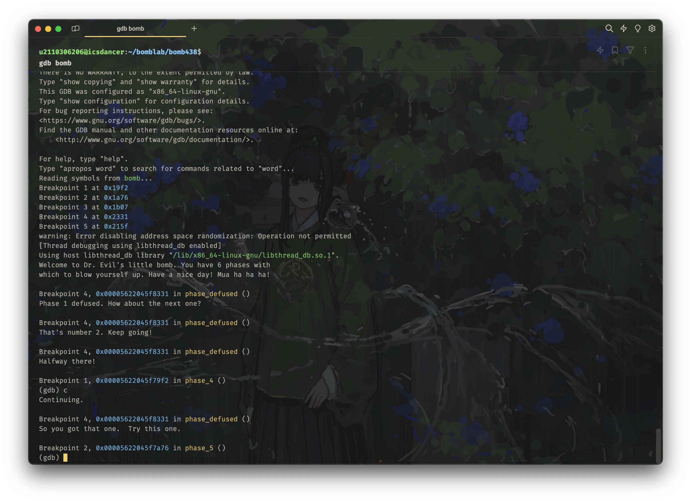

半途已过！

## Phase 5

依旧很长：

```asm
0000000000001a76 <phase_5>:
    1a76:	f3 0f 1e fa          	endbr64
    1a7a:	53                   	push   %rbx
    1a7b:	48 83 ec 10          	sub    $0x10,%rsp
    1a7f:	48 89 fb             	mov    %rdi,%rbx
    1a82:	64 48 8b 04 25 28 00 	mov    %fs:0x28,%rax
    1a89:	00 00
    1a8b:	48 89 44 24 08       	mov    %rax,0x8(%rsp)
    1a90:	31 c0                	xor    %eax,%eax
    1a92:	e8 09 03 00 00       	call   1da0 <string_length>
    1a97:	83 f8 06             	cmp    $0x6,%eax
    1a9a:	75 28                	jne    1ac4 <phase_5+0x4e>
    1a9c:	b8 00 00 00 00       	mov    $0x0,%eax
    1aa1:	83 f8 05             	cmp    $0x5,%eax
    1aa4:	7f 25                	jg     1acb <phase_5+0x55>
    1aa6:	48 63 c8             	movslq %eax,%rcx
    1aa9:	0f b6 14 0b          	movzbl (%rbx,%rcx,1),%edx
    1aad:	83 e2 0f             	and    $0xf,%edx
    1ab0:	48 8d 35 49 29 00 00 	lea    0x2949(%rip),%rsi        # 4400 <array.3497>
    1ab7:	0f b6 14 16          	movzbl (%rsi,%rdx,1),%edx
    1abb:	88 54 0c 01          	mov    %dl,0x1(%rsp,%rcx,1)
    1abf:	83 c0 01             	add    $0x1,%eax
    1ac2:	eb dd                	jmp    1aa1 <phase_5+0x2b>
    1ac4:	e8 52 06 00 00       	call   211b <explode_bomb>
    1ac9:	eb d1                	jmp    1a9c <phase_5+0x26>
    1acb:	c6 44 24 07 00       	movb   $0x0,0x7(%rsp)
    1ad0:	48 8d 7c 24 01       	lea    0x1(%rsp),%rdi
    1ad5:	48 8d 35 d2 26 00 00 	lea    0x26d2(%rip),%rsi        # 41ae <_IO_stdin_used+0x1ae>
    1adc:	e8 d7 02 00 00       	call   1db8 <strings_not_equal>
    1ae1:	85 c0                	test   %eax,%eax
    1ae3:	75 16                	jne    1afb <phase_5+0x85>
    1ae5:	48 8b 44 24 08       	mov    0x8(%rsp),%rax
    1aea:	64 48 33 04 25 28 00 	xor    %fs:0x28,%rax
    1af1:	00 00
    1af3:	75 0d                	jne    1b02 <phase_5+0x8c>
    1af5:	48 83 c4 10          	add    $0x10,%rsp
    1af9:	5b                   	pop    %rbx
    1afa:	c3                   	ret
    1afb:	e8 1b 06 00 00       	call   211b <explode_bomb>
    1b00:	eb e3                	jmp    1ae5 <phase_5+0x6f>
    1b02:	e8 89 f7 ff ff       	call   1290 <__stack_chk_fail@plt>
```

老规矩，先注释掉 `.gdbinit` 中的 `b phase_4` 断点。

不同于过去的几个 phase，我们发现这里没有调用 `sscanf` 函数，而是直接调用了 `string_length` 函数，这个函数的作用是计算字符串的长度。

结合代码，我们得知需要输入的是一个长度为 6 的字符串。

那么，我们首先修改 `psol.txt`，随便输一个字符串试试：

```text
Catherine Earnshaw, may you not rest as long as I am living.
1 2 4 8 16 32
6 q 866
5 20
pkuawa
pku is better than thu
```

> 注意这里是一定要多一行的，否则会识别错误。

继续来看剩下的核心代码：

```asm
    1a9c:	b8 00 00 00 00       	mov    $0x0,%eax
    1aa1:	83 f8 05             	cmp    $0x5,%eax
    1aa4:	7f 25                	jg     1acb <phase_5+0x55>
    1aa6:	48 63 c8             	movslq %eax,%rcx
    1aa9:	0f b6 14 0b          	movzbl (%rbx,%rcx,1),%edx
    1aad:	83 e2 0f             	and    $0xf,%edx
    1ab0:	48 8d 35 49 29 00 00 	lea    0x2949(%rip),%rsi        # 4400 <array.3497>
    1ab7:	0f b6 14 16          	movzbl (%rsi,%rdx,1),%edx
    1abb:	88 54 0c 01          	mov    %dl,0x1(%rsp,%rcx,1)
    1abf:	83 c0 01             	add    $0x1,%eax
    1ac2:	eb dd                	jmp    1aa1 <phase_5+0x2b>
    1ac4:	e8 52 06 00 00       	call   211b <explode_bomb>
    1ac9:	eb d1                	jmp    1a9c <phase_5+0x26>
    1acb:	c6 44 24 07 00       	movb   $0x0,0x7(%rsp)
    1ad0:	48 8d 7c 24 01       	lea    0x1(%rsp),%rdi
    1ad5:	48 8d 35 d2 26 00 00 	lea    0x26d2(%rip),%rsi        # 41ae <_IO_stdin_used+0x1ae>
    1adc:	e8 d7 02 00 00       	call   1db8 <strings_not_equal>
    1ae1:	85 c0                	test   %eax,%eax
    1ae3:	75 16                	jne    1afb <phase_5+0x85>
```

我们发现，这里首先将 `%eax` 置为 0，然后比较 `%eax` 和 5 的大小，如果大于 5，就跳转到 `1acb` 处。从而我们可以结合之前的经验，立刻推断出这里应该是一个循环，循环的次数为 6 次，而 `%eax` 即为循环变量。每个循环体内，`%rcx` 都会被首先赋值为 `%eax`。

继续阅读，发现这里计算变址用到了 `%rbx`，往上找发现这个寄存器被赋值为 `%rdi`，而 `%rdi` 是我们传入的第一个参数，也就是我们输入的字符串。

这里的变址计算等价于从我们输入的字符串中取出一个字符，然后赋值给 `%edx`。接着，我们发现它对 `%edx` 进行了一个 `and 0xf` 的操作。

我们知道，一个字符（char）类型占有 1 个字节，也就是 8 位，而 0xf 的二进制表示为 0000 1111，也就是说，这里的操作等价于将 `%edx` 的值的高 4 位清零。

接着，它将 `%rsi` 设置为一个地址，通过反汇编给出的注释我们发现这是一个数组，因而我们使用 `gdb` 的 `x` 命令打印出来：

```bash
gdb bomb
layout asm
layout regs
# 在 lea    0x2949(%rip),%rsi 的下一行设置断点，从而获得更新后的 %rsi
b *(phase_5+65)
c
x/s $rsi
```

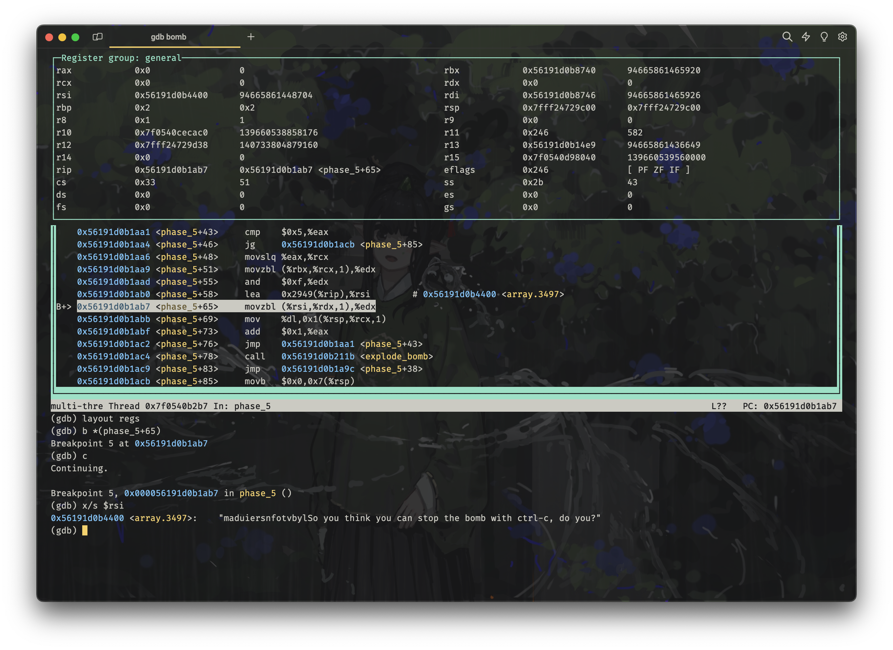

我们发现这个字符数组 / 字符串的内容是：

```text
(gdb) x/s $rsi
0x563f6ebe4400 <array.3497>:    "maduiersnfotvbylSo you think you can stop the bomb with ctrl-c, do you?"
```

而后，它又使用之前花了大力气计算来的 `%rdx` 的值作为下标，从 `%rsi` 指向的数组中取出一个字符，赋值给 `%edx`。再取出 `%edx` 的低 8 位，即 `%dl`，存入 `%rsp + %rcx + 1` 处，即从栈顶开始往上存。

使用循环重复这个过程 6 次，我们就可以在 `%rsp + 1` 开始的 6 个字节中存入 6 个跳来跳去获得到的字符。

在 `1aa4` 跳出循环后，我们发现它将 `%rsp + 0x7` 处的值置为 0，然后将 `%rsp + 0x1` 处的值赋值给 `%rdi`（第一个参数），将 `%rsp + 0x26d2` （**注意这里和之前不一样！**）处的值赋值给 `%rsi`（第二个参数），然后调用 `strings_not_equal` 函数判断是否相等。

我们首先使用 `gdb` 的 `x` 命令打印出 `%rsp + 0x26d2` 这里开始的 6 个字符，从而获知我们要凑的字符串是什么：

```bash
gdb bomb
layout asm
layout regs
# 在 lea    0x26d2(%rip),%rsi 的下一行设置断点，从而获得更新后的 %rsi
# 也就是 call   1db8 <strings_not_equal> 这一行，执行 strings_not_equal 之前
b *(phase_5+102)
c
x/6c $rsi
```

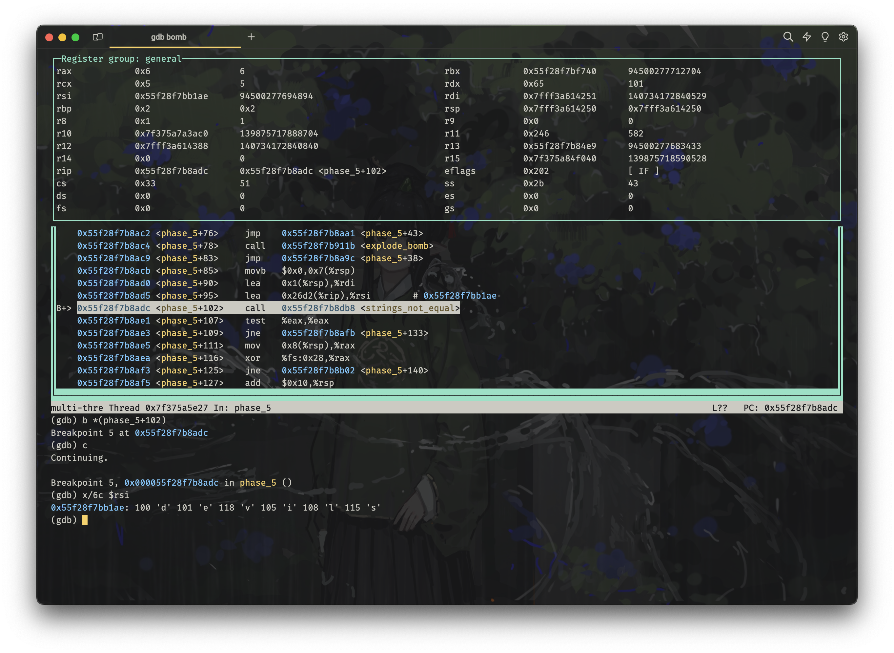

```text
(gdb) x/6c $rsi
0x55f28f7bb1ae: 100 'd' 101 'e' 118 'v' 105 'i' 108 'l' 115 's'
```

最终，我们发现这里需要匹配上的字符串是：devils

这个过程不可谓不离奇曲折，但是当我们知道了具体的过程之后，就可以很容易地得到答案了。

首先，我们先去维基百科找来一张 [ASCII 码表](https://zh.wikipedia.org/wiki/ASCII)：

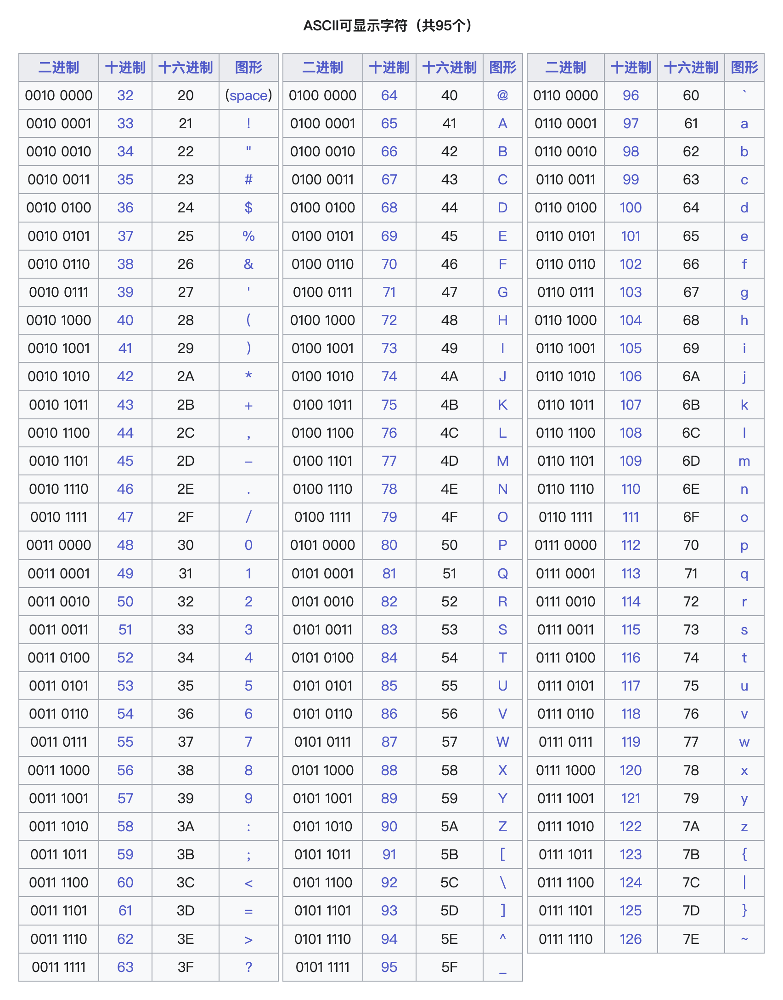

然后我们开启反向解码操作：

1. 第一个需要的字符为 `d`，由于我们可以指定的 `%rdx` 的值的范围为 0 ~ 15（这刚好对应 "So" 前面的 "maduiersnfotvbyl" 这 16 个字符）。其中 `d` 位于第 3 个，也就是需要选择一个低 4 位为 `0010`（索引为 2）的字符，选择 `b` 即可。
2. 第二个需要的字符为 `e`，类似地，`e` 位于可用字符串的第 6 个，也就是需要选择一个低 4 位为 `0101`（索引为 5）的字符，选择 `e` 即可。
3. 第三个需要的字符为 `v`，类似地，`v` 位于可用字符串的第 13 个，也就是需要选择一个低 4 位为 `1100`（索引为 12）的字符，选择 `l` 即可。
4. 第四个需要的字符为 `i`，类似地，`i` 位于可用字符串的第 5 个，也就是需要选择一个低 4 位为 `0100`（索引为 4）的字符，选择 `d` 即可。
5. 第五个需要的字符为 `l`，类似地，`l` 位于可用字符串的第 16 个，也就是需要选择一个低 4 位为 `1111`（索引为 15）的字符，选择 `o` 即可。
6. 第六个需要的字符为 `s`，类似地，`s` 位于可用字符串的第 8 个，也就是需要选择一个低 4 位为 `0111`（索引为 7）的字符，选择 `g` 即可。

最终，我们可以得到 phase 5 的答案：

```text
beldog
```

将其写入 `psol.txt` 的第五行：

```text
Catherine Earnshaw, may you not rest as long as I am living.
1 2 4 8 16 32
6 q 866
5 20
beldog
pku is better than thu
```

然后重新使用 `gdb` 运行程序：

```bash
gdb bomb
c
```

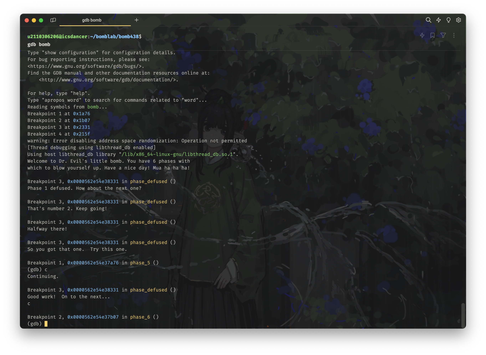

拿下！

## Phase 6

最后一关了，也是最难的、代码长的最离谱的一关：

```asm
0000000000001b07 <phase_6>:
    1b07:	f3 0f 1e fa          	endbr64
    1b0b:	41 54                	push   %r12
    1b0d:	55                   	push   %rbp
    1b0e:	53                   	push   %rbx
    1b0f:	48 83 ec 60          	sub    $0x60,%rsp
    1b13:	64 48 8b 04 25 28 00 	mov    %fs:0x28,%rax
    1b1a:	00 00
    1b1c:	48 89 44 24 58       	mov    %rax,0x58(%rsp)
    1b21:	31 c0                	xor    %eax,%eax
    1b23:	48 89 e6             	mov    %rsp,%rsi
    1b26:	e8 76 06 00 00       	call   21a1 <read_six_numbers>
    1b2b:	bd 00 00 00 00       	mov    $0x0,%ebp
    1b30:	eb 27                	jmp    1b59 <phase_6+0x52>
    1b32:	e8 e4 05 00 00       	call   211b <explode_bomb>
    1b37:	eb 33                	jmp    1b6c <phase_6+0x65>
    1b39:	83 c3 01             	add    $0x1,%ebx
    1b3c:	83 fb 05             	cmp    $0x5,%ebx
    1b3f:	7f 15                	jg     1b56 <phase_6+0x4f>
    1b41:	48 63 c5             	movslq %ebp,%rax
    1b44:	48 63 d3             	movslq %ebx,%rdx
    1b47:	8b 3c 94             	mov    (%rsp,%rdx,4),%edi
    1b4a:	39 3c 84             	cmp    %edi,(%rsp,%rax,4)
    1b4d:	75 ea                	jne    1b39 <phase_6+0x32>
    1b4f:	e8 c7 05 00 00       	call   211b <explode_bomb>
    1b54:	eb e3                	jmp    1b39 <phase_6+0x32>
    1b56:	44 89 e5             	mov    %r12d,%ebp
    1b59:	83 fd 05             	cmp    $0x5,%ebp
    1b5c:	7f 17                	jg     1b75 <phase_6+0x6e>
    1b5e:	48 63 c5             	movslq %ebp,%rax
    1b61:	8b 04 84             	mov    (%rsp,%rax,4),%eax
    1b64:	83 e8 01             	sub    $0x1,%eax
    1b67:	83 f8 05             	cmp    $0x5,%eax
    1b6a:	77 c6                	ja     1b32 <phase_6+0x2b>
    1b6c:	44 8d 65 01          	lea    0x1(%rbp),%r12d
    1b70:	44 89 e3             	mov    %r12d,%ebx
    1b73:	eb c7                	jmp    1b3c <phase_6+0x35>
    1b75:	be 00 00 00 00       	mov    $0x0,%esi
    1b7a:	eb 08                	jmp    1b84 <phase_6+0x7d>
    1b7c:	48 89 54 cc 20       	mov    %rdx,0x20(%rsp,%rcx,8)
    1b81:	83 c6 01             	add    $0x1,%esi
    1b84:	83 fe 05             	cmp    $0x5,%esi
    1b87:	7f 1d                	jg     1ba6 <phase_6+0x9f>
    1b89:	b8 01 00 00 00       	mov    $0x1,%eax
    1b8e:	48 8d 15 7b 65 00 00 	lea    0x657b(%rip),%rdx        # 8110 <node1>
    1b95:	48 63 ce             	movslq %esi,%rcx
    1b98:	39 04 8c             	cmp    %eax,(%rsp,%rcx,4)
    1b9b:	7e df                	jle    1b7c <phase_6+0x75>
    1b9d:	48 8b 52 08          	mov    0x8(%rdx),%rdx
    1ba1:	83 c0 01             	add    $0x1,%eax
    1ba4:	eb ef                	jmp    1b95 <phase_6+0x8e>
    1ba6:	48 8b 5c 24 20       	mov    0x20(%rsp),%rbx
    1bab:	48 89 d9             	mov    %rbx,%rcx
    1bae:	b8 01 00 00 00       	mov    $0x1,%eax
    1bb3:	eb 12                	jmp    1bc7 <phase_6+0xc0>
    1bb5:	48 63 d0             	movslq %eax,%rdx
    1bb8:	48 8b 54 d4 20       	mov    0x20(%rsp,%rdx,8),%rdx
    1bbd:	48 89 51 08          	mov    %rdx,0x8(%rcx)
    1bc1:	83 c0 01             	add    $0x1,%eax
    1bc4:	48 89 d1             	mov    %rdx,%rcx
    1bc7:	83 f8 05             	cmp    $0x5,%eax
    1bca:	7e e9                	jle    1bb5 <phase_6+0xae>
    1bcc:	48 c7 41 08 00 00 00 	movq   $0x0,0x8(%rcx)
    1bd3:	00
    1bd4:	bd 00 00 00 00       	mov    $0x0,%ebp
    1bd9:	eb 07                	jmp    1be2 <phase_6+0xdb>
    1bdb:	48 8b 5b 08          	mov    0x8(%rbx),%rbx
    1bdf:	83 c5 01             	add    $0x1,%ebp
    1be2:	83 fd 04             	cmp    $0x4,%ebp
    1be5:	7f 11                	jg     1bf8 <phase_6+0xf1>
    1be7:	48 8b 43 08          	mov    0x8(%rbx),%rax
    1beb:	8b 00                	mov    (%rax),%eax
    1bed:	39 03                	cmp    %eax,(%rbx)
    1bef:	7e ea                	jle    1bdb <phase_6+0xd4>
    1bf1:	e8 25 05 00 00       	call   211b <explode_bomb>
    1bf6:	eb e3                	jmp    1bdb <phase_6+0xd4>
    1bf8:	48 8b 44 24 58       	mov    0x58(%rsp),%rax
    1bfd:	64 48 33 04 25 28 00 	xor    %fs:0x28,%rax
    1c04:	00 00
    1c06:	75 09                	jne    1c11 <phase_6+0x10a>
    1c08:	48 83 c4 60          	add    $0x60,%rsp
    1c0c:	5b                   	pop    %rbx
    1c0d:	5d                   	pop    %rbp
    1c0e:	41 5c                	pop    %r12
    1c10:	c3                   	ret
    1c11:	e8 7a f6 ff ff       	call   1290 <__stack_chk_fail@plt>
```

仍旧是先注释掉 `.gdbinit` 中的 `b phase_5` 断点。

在做这个 phase 之前，我建议大家先做好心理准备，这个 phase 可能光读懂它就需要数个小时，这是我当初做的笔记：

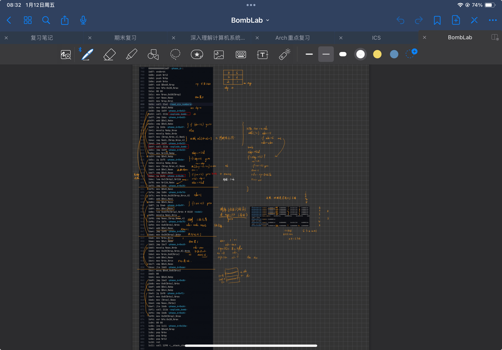

略过前面常规的压栈保存被调用者保存寄存器、金丝雀值处理，我们直接进入核心部分：

```asm
    1b23:	48 89 e6             	mov    %rsp,%rsi                    # 将栈顶指针作为第二个参数，存储读出的 6 个数字
    1b26:	e8 76 06 00 00       	call   21a1 <read_six_numbers>
    1b2b:	bd 00 00 00 00       	mov    $0x0,%ebp                    # 循环变量初始化
    1b30:	eb 27                	jmp    1b59 <phase_6+0x52>
    1b32:	e8 e4 05 00 00       	call   211b <explode_bomb>
    1b37:	eb 33                	jmp    1b6c <phase_6+0x65>
    1b39:	83 c3 01             	add    $0x1,%ebx                    # 让 %ebx 加 1
    1b3c:	83 fb 05             	cmp    $0x5,%ebx                    # 比较 %ebx 和 5
    1b3f:	7f 15                	jg     1b56 <phase_6+0x4f>          # 如果大于 5，就跳转到 1b56 处
    1b41:	48 63 c5             	movslq %ebp,%rax                    # 否则，将循环变量 %ebp 的值存入 %rax
    1b44:	48 63 d3             	movslq %ebx,%rdx                    # 将 %ebx (→ %r12d → %rbp + 1) 的值存入 %rdx
    1b47:	8b 3c 94             	mov    (%rsp,%rdx,4),%edi           # 取出输入的对应第 %rdx (→ %ebp + 1) 处的值
    1b4a:	39 3c 84             	cmp    %edi,(%rsp,%rax,4)           # 比较输入的对应第 %rax (→ %ebp) 处的值和 %edi(继承于上一条指令，即读出的数组对应 %rdx(→ %ebx → %ebp + 1 ) 处的值)
    1b4d:	75 ea                	jne    1b39 <phase_6+0x32>          # 如果不相等，就跳转到 1b39 处，继续循环
    1b4f:	e8 c7 05 00 00       	call   211b <explode_bomb>          # 如果相等，就跳转到 211b 处，引爆炸弹
    1b54:	eb e3                	jmp    1b39 <phase_6+0x32>          # 炸完了继续 phase 6 的退出过程
    1b56:	44 89 e5             	mov    %r12d,%ebp                   # 将 %r12d 的值存入 %ebp
    1b59:	83 fd 05             	cmp    $0x5,%ebp                    # 循环条件，判断 %ebp 是否大于 5
    1b5c:	7f 17                	jg     1b75 <phase_6+0x6e>          # 跳出条件满足，跳出循环
    1b5e:	48 63 c5             	movslq %ebp,%rax                    # 不跳出，继续循环体
    1b61:	8b 04 84             	mov    (%rsp,%rax,4),%eax           # 取出输入的对应第 %rax (→ %ebp) 处的值，存入 %eax
    1b64:	83 e8 01             	sub    $0x1,%eax                    # %eax 减 1
    1b67:	83 f8 05             	cmp    $0x5,%eax                    # 判断是否大于 5
    1b6a:	77 c6                	ja     1b32 <phase_6+0x2b>          # 如果大于 5，就跳转到 1b32 处，引爆炸弹
    1b6c:	44 8d 65 01          	lea    0x1(%rbp),%r12d              # 否则，将循环变量 %rbp 加 1，存入 %r12d
    1b70:	44 89 e3             	mov    %r12d,%ebx                   # 将 %r12d 的值存入 %ebx
    1b73:	eb c7                	jmp    1b3c <phase_6+0x35>          # 跳转到 1b3c 处，继续循环
```

我们发现，就像 phase 4 一样，这里首先通过 `read_six_numbers` 函数读入了 6 个数字（依次存放在 `%rsp` 到 `%rsp + 0x18` 的 24 个字节处），然后将 `%ebp` 置为 0，再进行了一个比较 `cmp    $0x5,%ebp`，如果大于 5，就跳转到 `1b75` 处。

很显然，这里又是一个循环，循环变量为 `%ebp`，循环次数为 6 次。

接着看 `1b5e` 开始的几句指令，我们发现每次循环内，首先读出了一个我们输入的数字，然后减 1，再判断是否大于 5，如果大于 5，就跳转到 `1b32` 处，引爆炸弹。

这告诉我们，我们输入的每个数字必须小于等于 6。

接着跳转回 `1b3c` 处，继续循环。我们阅读 `1b39` ~ `1b54` 的这一段指令，可以发现它通过维护了另外一个循环变量 `%ebx`，来遍历比较了我们输入的第 1 个数字和后面 5 个数字，如果有相等的，就会爆炸。

继续类推，观察到每次退出这个由 `%ebx` 控制的子循环后，会在 `1b56` 处将 `%r12d` 的值存入 `%ebp`，从而更新外层循环变量。

于是我们不难推断，这类似于一个冒泡排序：

```c
for(int ebp = 0; ebp < 6; ebp++) {
    for(int ebx = ebp + 1; ebx < 6; ebx++) {
        if(input[ebp] == input[ebx]) {
            explode_bomb();
        }
    }
}
```

所以这段代码的目的，就是判断我们输入的 6 个数字是否有重复的。

因而我们得知，我们输入的 6 个数字必须是不同的。

所以我们更新 `psol.txt`，将第 6 行更改为符合要求的数字：

```text
Catherine Earnshaw, may you not rest as long as I am living.
1 2 4 8 16 32
6 q 866
5 20
beldog
2 1 3 4 6 5

```

继续看下面的代码：

```asm
    1b75:	be 00 00 00 00       	mov    $0x0,%esi                    # 将 0 存入 %esi，作为循环变量
    1b7a:	eb 08                	jmp    1b84 <phase_6+0x7d>          # 跳转到 1b84，对于初始化状态，跳过更新 %esi 的指令
    1b7c:	48 89 54 cc 20       	mov    %rdx,0x20(%rsp,%rcx,8)       # 将 %rdx 的值存到 (%rsp + %rcx*8 + 0x20) 的位置
    1b81:	83 c6 01             	add    $0x1,%esi                    # %esi 加 1
    1b84:	83 fe 05             	cmp    $0x5,%esi                    # 比较 %esi 和 5
    1b87:	7f 1d                	jg     1ba6 <phase_6+0x9f>          # 如果大于 5，跳转到 1ba6，这标志了循环会被执行 6 次
    1b89:	b8 01 00 00 00       	mov    $0x1,%eax                    # 将 1 存入 %eax
    1b8e:	48 8d 15 7b 65 00 00 	lea    0x657b(%rip),%rdx            # 8110 <node1> # 加载 node1 的地址到 %rdx
    1b95:	48 63 ce             	movslq %esi,%rcx                    # 将 %esi 符号扩展到 %rcx
    1b98:	39 04 8c             	cmp    %eax,(%rsp,%rcx,4)           # 比较 %eax 和 (%rsp + %rcx*4) 的值
    1b9b:	7e df                	jle    1b7c <phase_6+0x75>          # 如果小于或等于，跳转到 1b7c
    1b9d:	48 8b 52 08          	mov    0x8(%rdx),%rdx               # 将 (%rdx + 8) 的值存入 %rdx
    1ba1:	83 c0 01             	add    $0x1,%eax                    # %eax 加 1
    1ba4:	eb ef                	jmp    1b95 <phase_6+0x8e>          # 跳转到 1b95
```

不难看出这里还是执行了一个循环，循环变量为 `%esi`，循环次数为 6 次。

继续阅读代码，发现在 `1b8e` 处读取了一个叫做 `node1` 的东西的地址到 `%rdx`，很自然的联想到这应该是一个线性表，而且大概率是一个链表。我们首先使用 `gdb` 的 `x` 命令打印出 `%rdx` 的值：

```bash
gdb bomb
# 此时 b phase_5 应当已经被注释掉了
layout asm
layout regs
# 在 lea    0x657b(%rip),%rdx 的下一行设置断点，从而获得更新后的 %rdx
b *(phase_6+142)
c
# 十进制打印 %rdx 开始的 24 个数
x/24 $rdx
```

得到输出：

```text
(gdb) x/24 $rdx
0x55ee5f1db110 <node1>: 285     1       1595781408      21998
0x55ee5f1db120 <node2>: 683     2       1595781424      21998
0x55ee5f1db130 <node3>: 324     3       1595781440      21998
0x55ee5f1db140 <node4>: 960     4       1595781456      21998
0x55ee5f1db150 <node5>: 355     5       1595777152      21998
0x55ee5f1db160 <host_table>:    1595766700      21998   1595766709      21998
```

一下子打印出来 5 个节点，可以看出每个节点的 16 个字节中，最低的 4 个字节是一个大小范围合适的数字，猜测是链表节点的 `value` 信息，而次低的 4 个字节是一个从 1 开始的递增的数字，猜测是链表节点的 `key` 信息，而最高的 8 个字节看不出来是个什么东西，所以我们换用 16 进制打印：

```bash
x/24x $rdx
```

得到输出：

```text
(gdb) x/24x $rdx
0x55ee5f1db110 <node1>: 0x0000011d      0x00000001      0x5f1db120      0x000055ee
0x55ee5f1db120 <node2>: 0x000002ab      0x00000002      0x5f1db130      0x000055ee
0x55ee5f1db130 <node3>: 0x00000144      0x00000003      0x5f1db140      0x000055ee
0x55ee5f1db140 <node4>: 0x000003c0      0x00000004      0x5f1db150      0x000055ee
0x55ee5f1db150 <node5>: 0x00000163      0x00000005      0x5f1da080      0x000055ee
0x55ee5f1db160 <host_table>:    0x5f1d77ac      0x000055ee      0x5f1d77b5      0x000055ee
```

再次观察每个节点的最高 8 个字节，结合我们上课学习的知识，我们知道在现在主流的机器中都采用小端法表示，而且为 64 位机器，所以指针的长度是 8 个字节，进而我们可以推测出，每个节点的最高 8 个字节应该是一个指向下一个节点的指针，譬如，对于 `node1` 来说，他的最高 8 个字节是 `0x5f1db130 0x000055ee`，也就是正常表示下的 `0x000055ee5f1db130`，而这个地址正好是 `node2` 的地址，所以我们可以推测出，每个节点的最高 8 个字节是一个指向下一个节点的指针。

也就是说，这个链表的每个元素大概是这样的：

```c
struct node {
    int value;
    int key;
    struct node *next;
};
```

结合我们之前发现整个循环会被执行 6 次，而这里只有 5 个节点，所以我们猜测 `node6` 应该是被存放在了别的地方，我们使用 `node5` 的最高 8 个字节推断出 `node6` 的首地址为 `0x000055ee5f1da080`，然后使用 `x` 命令打印出 `node6` 的内容：

```bash
x/4 $0x000055ee5f1da080
```

得到：

```text
(gdb) x/4 0x000055ee5f1da080
0x55ee5f1da080 <node6>: 0x00000310      0x00000006      0x00000000      0x00000000
```

发现不知道为啥打印出来是 16 进制，但是我们已经可以从这里看出 `node6` 的后继指针为 `NULL`，所以我们可以推断出，`node6` 是此链表最后的节点。

我们要求它打印出 10 进制：

```bash
x/4d 0x000055ee5f1da080
```

得到：

```text
(gdb) x/4d 0x000055ee5f1da080
0x55ee5f1da080 <node6>: 784     6       0       0
```

从而我们得到了完整的链表内容：

```text
0x55ee5f1db110 <node1>: 285     1       &node2
0x55ee5f1db120 <node2>: 683     2       &node3
0x55ee5f1db130 <node3>: 324     3       &node4
0x55ee5f1db140 <node4>: 960     4       &node5
0x55ee5f1db150 <node5>: 355     5       &node6
0x55ee5f1da080 <node6>: 784     6       NULL
```

到这里我们已经完全知道这个数据结构长啥样了，所以回去继续看代码（我懒得上下翻，我想大家应该也不想，所以又复制了一遍）：

```asm
    1b75:	be 00 00 00 00       	mov    $0x0,%esi                    # 将 0 存入 %esi，作为循环变量
    1b7a:	eb 08                	jmp    1b84 <phase_6+0x7d>          # 跳转到 1b84，对于初始化状态，跳过更新 %esi 的指令
    1b7c:	48 89 54 cc 20       	mov    %rdx,0x20(%rsp,%rcx,8)       # 将 %rdx 的值存到 (%rsp + %rcx*8 + 0x20) 的位置
    1b81:	83 c6 01             	add    $0x1,%esi                    # %esi 加 1
    1b84:	83 fe 05             	cmp    $0x5,%esi                    # 比较 %esi 和 5
    1b87:	7f 1d                	jg     1ba6 <phase_6+0x9f>          # 如果大于 5，跳转到 1ba6
    1b89:	b8 01 00 00 00       	mov    $0x1,%eax                    # 将 1 存入 %eax
    1b8e:	48 8d 15 7b 65 00 00 	lea    0x657b(%rip),%rdx            # 8110 <node1> # 加载 node1 的地址到 %rdx
    1b95:	48 63 ce             	movslq %esi,%rcx                    # 将 %esi 符号扩展到 %rcx
    1b98:	39 04 8c             	cmp    %eax,(%rsp,%rcx,4)           # 比较 %eax 和 (%rsp + %rcx*4) 的值

    1b9b:	7e df                	jle    1b7c <phase_6+0x75>          # 如果小于或等于，跳转到 1b7c

    1b9d:	48 8b 52 08          	mov    0x8(%rdx),%rdx               # 将 (%rdx + 8) 的值存入 %rdx，即准备遍历下一个节点
    1ba1:	83 c0 01             	add    $0x1,%eax                    # %eax 加 1

    1ba4:	eb ef                	jmp    1b95 <phase_6+0x8e>          # 跳转到 1b95

    1ba6:	48 8b 5c 24 20       	mov    0x20(%rsp),%rbx              # 将 (%rsp + 0x20) 的值存入 %rbx
    1bab:	48 89 d9             	mov    %rbx,%rcx                    # 将 %rbx 的值存入 %rcx
    1bae:	b8 01 00 00 00       	mov    $0x1,%eax                    # 将 1 存入 %eax
    1bb3:	eb 12                	jmp    1bc7 <phase_6+0xc0>          # 跳转到 1bc7
    1bb5:	48 63 d0             	movslq %eax,%rdx                    # 将 %eax 符号扩展到 %rdx
    1bb8:	48 8b 54 d4 20       	mov    0x20(%rsp,%rdx,8),%rdx       # 将 (%rsp + %rdx*8 + 0x20) 的值存入 %rdx
    1bbd:	48 89 51 08          	mov    %rdx,0x8(%rcx)               # 将 %rdx 的值存到 (%rcx + 8) 的位置
    1bc1:	83 c0 01             	add    $0x1,%eax                    # %eax 加 1
    1bc4:	48 89 d1             	mov    %rdx,%rcx                    # 将 %rdx 的值存入 %rcx
    1bc7:	83 f8 05             	cmp    $0x5,%eax                    # 比较 %eax 和 5
    1bca:	7e e9                	jle    1bb5 <phase_6+0xae>          # 如果小于或等于，跳转到 1bb5
    1bcc:	48 c7 41 08 00 00 00 	movq   $0x0,0x8(%rcx)               # 将 0 存到 (%rcx + 8) 的位置
    00
    1bd4:	bd 00 00 00 00       	mov    $0x0,%ebp                    # 将 0 存入 %ebp
    1bd9:	eb 07                	jmp    1be2 <phase_6+0xdb>          # 跳转到 1be2
    1bdb:	48 8b 5b 08          	mov    0x8(%rbx),%rbx               # 将 (%rbx + 8) 的值存入 %rbx
    1bdf:	83 c5 01             	add    $0x1,%ebp                    # %ebp 加 1
    1be2:	83 fd 04             	cmp    $0x4,%ebp                    # 比较 %ebp 和 4
    1be5:	7f 11                	jg     1bf8 <phase_6+0xf1>          # 如果大于，跳转到 1bf8
    1be7:	48 8b 43 08          	mov    0x8(%rbx),%rax               # 将 (%rbx + 8) 的值存入 %rax
    1beb:	8b 00                	mov    (%rax),%eax                  # 将 (%rax) 的值存入 %eax
    1bed:	39 03                	cmp    %eax,(%rbx)                  # 比较 %eax 和 (%rbx) 的值
    1bef:	7e ea                	jle    1bdb <phase_6+0xd4>          # 如果小于或等于，跳转到 1bdb
    1bf1:	e8 25 05 00 00       	call   211b <explode_bomb>          # 否则，调用 explode_bomb 函数
    1bf6:	eb e3                	jmp    1bdb <phase_6+0xd4>          # 返回到 1bdb，继续循环
```

从 `1b95` 处开始继续看这个循环，我们发现直到 `1b9b` 它都会尝试匹配 `%eax`（不变）和你的输入（变化）的第 `%esi` 个数字，如果后者小于或等于 `%eax` ，就跳转到 `1b7c` 处（同时通过更新 `%esi` 循环条件进行顺位匹配），而 `%eax` 又是从 1 开始的，所以它在这里（第 1 次）随便一个 1 ~ 6 的数字都可以通过这个 `jle` 指令，继续后面的循环。但我们也很容易想到，这里的 `%eax` 应该会在后续过程中更新，而当它更新到 6 时，那么就只有 6 这个数字可以通过这个 `jle` 指令。

当通过这个 `jle` 指令后，进入到 `1b9d` 处，我们发现它会将 `%rdx` 更新为 `%rdx` 的后继指针，然后再将 `%eax` 加 1，再跳转回 `1b95` 处，继续循环。

所以我们发现无论什么情况，这里都会往回跳转，唯一跳出的方式是在 `1b87` 处，将 `%esi` 更新为 6 时。

而当我们关注 `%esi` 的时候，我们发下它只有在从 `1b9b` 跳转到 `1b7c` 时才会更新，而这个跳转只有在 `%eax` 没有通过 `jle` 时才会触发，也就是当 `%eax` 已经大于你的输入的第 `%esi` 个数字时，才会触发。此时，`%rdx` 已经变成了指向你输入的第 `%esi` 个数字的节点的指针。

所以，我们可以推断出这里的大致逻辑是：

```c
for (esi = 0; esi < 6; esi++) {
    int eax = 1;
    // 遍历链表，找到第 esi 个节点
    while (eax <= esi) {
        node1 = node1->next;
        eax++;
    }
    nodes[esi] = node1;
}
```

所以，我们可以推断出，这里相当于将我们用户栈上 `%rsp + 0x20` 开始的一个 nodes 数组中的 6 个元素，依次存放了 6 个指针，分别指向了 6 个节点。顺次为我们输入的数字顺序。

我们可以通过如下方式验证：

```bash
gdb bomb
# 在这整个循环跳出的时候设置断点
# 也就是 1ba6 处
b *(phase_6+159)
c
# 以 16 进制打印从 %rsp + 0x20 开始的 6 个 8 字节数
x/6gx $rsp+0x20
```

得到输出：

```text
(gdb) x/6gx $rsp+0x20
0x7ffde0250b90: 0x000055b5b7f0c120      0x000055b5b7f0c110
0x7ffde0250ba0: 0x000055b5b7f0c130      0x000055b5b7f0c140
0x7ffde0250bb0: 0x000055b5b7f0b080      0x000055b5b7f0c150
```

回忆一下我们设定的输入是 `2 1 3 4 6 5`，再结合之前的顺序表：

```text
0x55ee5f1db110 <node1>: 285     1       &node2
0x55ee5f1db120 <node2>: 683     2       &node3
0x55ee5f1db130 <node3>: 324     3       &node4
0x55ee5f1db140 <node4>: 960     4       &node5
0x55ee5f1db150 <node5>: 355     5       &node6
0x55ee5f1da080 <node6>: 784     6       NULL
```

稍加翻译，得到：

```text
0x7ffde0250b90: &node2
0x7ffde0250b98: &node1
0x7ffde0250ba0: &node3
0x7ffde0250ba8: &node4
0x7ffde0250bb0: &node6
0x7ffde0250bb8: &node5
```

这和我们的预期是一致的。

再接着看剩下的代码。

```asm
    1ba6:	48 8b 5c 24 20       	mov    0x20(%rsp),%rbx              # 将 (%rsp + 0x20) 的值存入 %rbx
    1bab:	48 89 d9             	mov    %rbx,%rcx                    # 将 %rbx 的值存入 %rcx
    1bae:	b8 01 00 00 00       	mov    $0x1,%eax                    # 将 1 存入 %eax，作为循环变量
    1bb3:	eb 12                	jmp    1bc7 <phase_6+0xc0>          # 跳转到 1bc7
    1bb5:	48 63 d0             	movslq %eax,%rdx                    # 将 %eax 符号扩展到 %rdx
    1bb8:	48 8b 54 d4 20       	mov    0x20(%rsp,%rdx,8),%rdx       # 将 (%rsp + %rdx*8 + 0x20) 的值存入 %rdx
    1bbd:	48 89 51 08          	mov    %rdx,0x8(%rcx)               # 将 %rdx 的值存到 (%rcx + 8) 的位置
    1bc1:	83 c0 01             	add    $0x1,%eax                    # %eax 加 1
    1bc4:	48 89 d1             	mov    %rdx,%rcx                    # 将 %rdx 的值存入 %rcx
    1bc7:	83 f8 05             	cmp    $0x5,%eax                    # 比较 %eax 和 5
    1bca:	7e e9                	jle    1bb5 <phase_6+0xae>          # 如果小于或等于，跳转到 1bb5
```

现在我们已经确定，从 `%rsp + 0x20` 开始的 6 个 8 字节的内容，是一个指针数组，其中存放了 6 个指针，分别指向了 6 个节点。顺次为第 2 1 3 4 6 5 个节点（即我们的输入）。

接着，从 `1ba6` 开始，首先把 `%rsp + 0x20` 指向的值（也就是指向 `node2` 的指针）放入 `%rbx`，将 `%eax` 设置为 1，作为循环变量，然后跳转到 `1bc7`。

在 `1bc7` 处，对 `%eax` 和 5 进行比较，如果小于等于 5，就跳转到 `1bb5`，否则跳转到 `1bcc`。由此我们可以推断这是一个循环 5 次的循环，从 1 ~ 5。

回到 `1bb5` 处，首先将 `%eax` 符号扩展到 `%rdx`，然后将 `%rsp + %rdx*8 + 0x20` 的值存入 `%rdx`，也就是从 `%rsp + 0x20` 开始的第 `%eax` 个指针。

继续，将 `%rdx` 的值存入 `(%rcx + 8)`，回想第 1 行（`1ba6` 处），我们知道此时 `%rcx` 的值是一个指向 `node2` 的指针，所以这里的操作相当于将 `node2` 的 `next` 指针设置为 `%rdx` 指向的节点。

然后，将 `%eax` 加 1，将 `%rdx` 的值存入 `%rcx`，回到 `1bb5` 处，继续循环。

由此，我们得到这里的大致逻辑：

```c
struct node *prev_node = nodes[0];
for (eax = 1; eax <= 5; eax++) {
    prev_node->next = nodes[eax];
    prev_node = nodes[eax];
}
```

也就是说，这里将我们输入的 6 个节点，按照我们输入的顺序，执行了一个重排，重新连接成了一个链表。

原有的链表顺序是：

node1 -> node2 -> node3 -> node4 -> node5 -> node6

现在就成了：

node2 -> node1 -> node3 -> node4 -> node6 -> node5

接着看剩下的代码：

```asm
    1bcc:	48 c7 41 08 00 00 00 	movq   $0x0,0x8(%rcx)               # 将 0 存到 (%rcx + 8) 的位置
    00
    1bd4:	bd 00 00 00 00       	mov    $0x0,%ebp                    # 将 0 存入 %ebp
    1bd9:	eb 07                	jmp    1be2 <phase_6+0xdb>          # 跳转到 1be2
    1bdb:	48 8b 5b 08          	mov    0x8(%rbx),%rbx               # 将 (%rbx + 8) 的值存入 %rbx
    1bdf:	83 c5 01             	add    $0x1,%ebp                    # %ebp 加 1
    1be2:	83 fd 04             	cmp    $0x4,%ebp                    # 比较 %ebp 和 4
    1be5:	7f 11                	jg     1bf8 <phase_6+0xf1>          # 如果大于，跳转到 1bf8
    1be7:	48 8b 43 08          	mov    0x8(%rbx),%rax               # 将 (%rbx + 8) 的值存入 %rax
    1beb:	8b 00                	mov    (%rax),%eax                  # 将 (%rax) 的值存入 %eax
    1bed:	39 03                	cmp    %eax,(%rbx)                  # 比较 %eax 和 (%rbx) 的值
    1bef:	7e ea                	jle    1bdb <phase_6+0xd4>          # 如果小于或等于，跳转到 1bdb
    1bf1:	e8 25 05 00 00       	call   211b <explode_bomb>          # 否则，调用 explode_bomb 函数
    1bf6:	eb e3                	jmp    1bdb <phase_6+0xd4>          # 返回到 1bdb，继续循环
```

这里首先将 0 存入 `(%rcx + 8)` 的位置，也就是将之前排序完的最后一个节点（在这里对应 `node5`）的 `next` 指针设置为 `NULL`。

然后将 0 存入 `%ebp`，作为循环变量，跳转到 `1be2`。

在 `1be2` 处，比较 `%ebp` 和 4，如果大于 4，就跳转到 `1bf8`（对应后续的 `phase_6` 函数的正常退出流程），否则顺序执行 `1be7`。

在 `1be7` 处，将 `(%rbx + 8)` 的值存入 `%rax`，回看上一部分的开头，`%rbx` 的值是指向我们用户栈里的 6 个指针的第 1 个指针的指针，所以这里的操作相当于把这 6 个指针中的第 2 个指针的值存入 `%rbx`。

继续，将 `%ebp` 加 1，比较其与 4 的大小，如果大于 4，就跳转到 `1bf8` 正常退出函数，否则顺序执行 `1be7`。

在 `1be7` 处，将 `(%rbx + 8)` 的值存入 `%rax`，也就是保存下一个节点的地址。

然后使用 `(%rax)` 读出下一个节点的 `value`，与对应当前节点的 `value` 的 `(%rbx)` 执行比较，如果当前节点的 `value` 小于等于下一个节点的 `value`，就跳转到 `1bdb` 继续判断下一个节点，否则顺序执行到 `1bf1` 处，调用 `explode_bomb` 函数，引发爆炸。

所以这里的大致逻辑是：

```c
struct node *cur_node = nodes[0];
for (ebp = 0; ebp <= 4; ebp++) {
    struct node *next_node = cur_node->next;
    if (cur_node->value > next_node->value) {
        explode_bomb();
    }
    cur_node = cur_node->next;
}
```

至此，我们总算搞明白了 `phase_6` 整个的函数逻辑，可以开始构造正确的输入了。

首先回顾一下我们读出的初始链表长啥样：

```text
0x55ee5f1db110 <node1>: 285     1       &node2
0x55ee5f1db120 <node2>: 683     2       &node3
0x55ee5f1db130 <node3>: 324     3       &node4
0x55ee5f1db140 <node4>: 960     4       &node5
0x55ee5f1db150 <node5>: 355     5       &node6
0x55ee5f1da080 <node6>: 784     6       NULL
```

将之根据 `value` 的值，从小到大排序，得到：

```text
0x55ee5f1db110 <node1>: 285     1       &node2
0x55ee5f1db130 <node3>: 324     3       &node4
0x55ee5f1db150 <node5>: 355     5       &node6
0x55ee5f1db120 <node2>: 683     2       &node3
0x55ee5f1da080 <node6>: 784     6       NULL
0x55ee5f1db140 <node4>: 960     4       &node5
```

现在，这个 `nodeN` 的 `N` 信息的顺序，就是我们的答案：

```text
1 3 5 2 6 4
```

将之添加到 `psol.txt` 中：

```text
Catherine Earnshaw, may you not rest as long as I am living.
1 2 4 8 16 32
6 q 866
5 20
beldog
1 3 5 2 6 4
```

然后重启程序：

```bash
gdb bomb
# 此时 b phase_5 应当已经被注释掉了
c
```

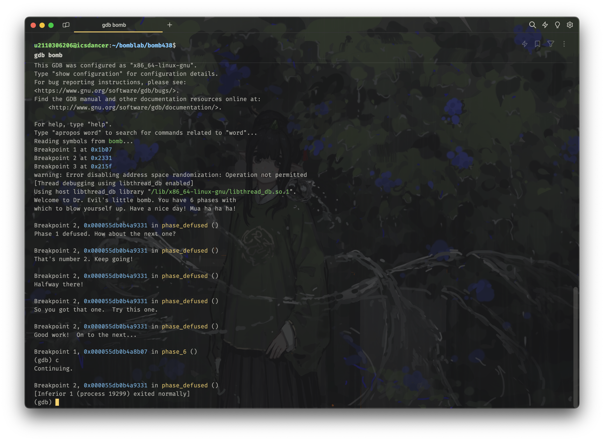

终于，我们完成了整个实验，我也结束了十数个小时的折磨。

当时做的时候，当你完成的时候应该是有这么一行的，但是现在不知道为什么没了，hhh。

```text
But,I can't give you a clear answer yet. You need to measure it yourself.
```

> 写在结尾：重做 Bomb lab 的感觉真的是挺无聊的，最初做的时候还不知道怎么安全化一个炸弹，每次都胆战心惊，而且当时不太会静态分析源码，大多数情况下都是结合着 `gdb` 一步一步 `ni` 观察变化，甚至一次次地去猜... 虽然麻烦，但至少真的有趣，而且真的学到了很多东西。
>
> 但是现在，已经考完试的寒假，坚持着来画上十数个小时重做一遍，还要撰写这么长的文章，只能说完全是凭借毅力和强迫症了 hhh

## 参考

[不周山 / 【读厚 CSAPP】II Bomb Lab](https://wdxtub.com/csapp/thick-csapp-lab-2/2016/04/16/)：这篇文章就是我当时做的时候主要的参考，讲的没我细（没我废话这么多），而且最后一个 phase 不太一样，供参考。
